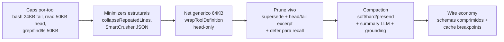
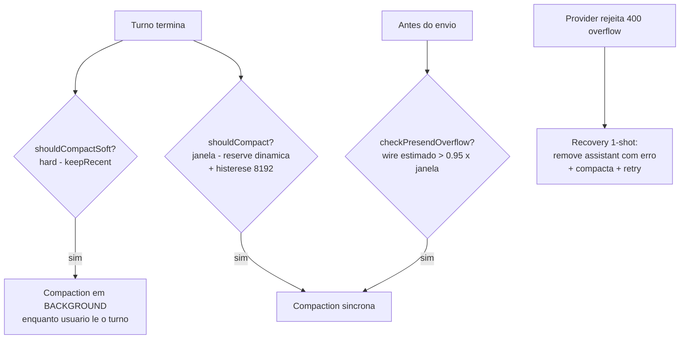
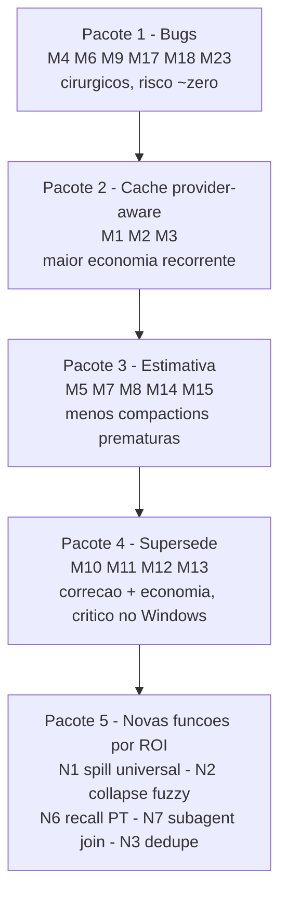

# Auditoria Completa — Sistema de Economia de Tokens do Pit

> **Data:** 2026-07-03
> **Escopo:** monorepo `pi-mono` (`C:/PiTest`) — pacotes `coding-agent`, `agent`, `ai`.
> **Metodologia:** 5 auditorias paralelas read-only (compaction, prune/recall, caps de tools, provider/cache, agent loop), cada uma com citação `arquivo:linha`. Os 4 achados mais graves foram verificados manualmente na fonte antes da publicação. Nenhuma edição de código foi feita.
> **Convenção:** estimativas de impacto sem medição direta estão marcadas `[INFERÊNCIA]` ou `[ESTIMATIVA]`.

---

> ## Status: IMPLEMENTADO (2026-07-03)
>
> Implementação em 5 waves de lanes paralelas com propriedade disjunta de arquivos, cada achado re-verificado na fonte antes da edição (portão de falso-positivo), gates completos entre waves (tsgo raiz + suíte inteira + token-bench).
>
> **Entregue:** os 7 bugs (M4, M6, M9, M17, M18, M23 + M3/Bug 4) · Pacote 2 completo (M1 relocação `<env>` do sufixo dinâmico nas rotas de prefix-cache automático, M2 split no formato-anthropic, M3 breakpoint na última tool) · Pacote 3 completo (M5 calibração EMA, M7 módulo `@pit/ai/token-estimate`, M8 budget dinâmico, M15 verify fundido, + unificação dos guards presend) · Pacote 4 completo (M10-M13, N4, N5) · higiene M14, M16, M19-M25 · novas funções N1, N2, N3, N6, N7, N8, N9, N10, N12 · `IMAGE_TOKENS` proporcional ao bloco. Baseline token-economy v9 (+2 chars, schemas honestos do M20); todos os demais benches fecharam com delta zero.
>
> **Falsos positivos encontrados na implementação:** o "doom-loop" do N8/§5.6 não usa `<system-reminder>` (tags próprias, `role:"custom"` — estruturalmente fora do prune de user messages; colapso restrito a overthink/TTSR, ancorado nas constantes dos geradores) · o rebuild-por-query do §5.7 já tinha cache WeakMap no hindsight bank (só o history-recall precisava).
>
> **Deferido com justificativa:** N11 trim-and-keep do overthink (mudança de ciclo de vida de stream com risco de regressão > ganho; requer prefill de assistant por provider) · N13 Gemini explicit caching (marcado exploratório na própria auditoria) · M8 segunda metade (truncar frame em vez de 2ª passada — não há API de rewrite de compaction entry; a causa estrutural da 2ª passada foi eliminada pela primeira metade) · M21 re-scale em `/model` switch (process-global por design, convenção do thermostat) · collapse fuzzy em `get_network_body` (corpo JSON: marcador `×N` quebraria o parse que o crush estrutural já cobre).

---

## 1. Sumário executivo

O Pit possui um sistema de economia de tokens **maduro e em camadas** — defesa em profundidade da fonte do output até o wire do provider. Os pontos fortes são reais: prefixo de system prompt bipartido e instrumentado, prune incremental sobre clones (preservando recall), deferral com recuperação sob demanda, sumarização com self-correction e grounding determinístico, e compressão de schemas no wire.

A auditoria encontrou:

- **7 bugs confirmados** (4 verificados linha a linha na fonte), incluindo um vazamento de marcador de controle para o Gemini e um double-count que dispara compaction prematura;
- **1 grande alavanca desperdiçada**: o cache de prompt só é explorado de verdade no caminho Anthropic-nativo — em OpenAI/Google/OpenRouter, o sufixo dinâmico invalida o cache da conversa inteira a cada turno;
- **~20 oportunidades concretas** de melhoria, entre correções, aprimoramentos e funções novas, priorizadas na seção 8.

---

## 2. Arquitetura geral

### 2.1 As cinco camadas (da fonte ao wire)



1. **Caps por-tool** — limites calibrados por semântica dentro do `execute` de cada tool (bash mantém a *cauda* porque erros ficam no fim; read mantém a *cabeça* com paginação por `offset`).
2. **Minimizers estruturais** — compressão lossless-first (`collapseRepeatedLines`, crush de JSON) que só faz *upgrade* de cortes que já ocorreriam.
3. **Net genérico de 64KB** — `capToolOutputBytes` em `wrapToolDefinition` (`tools/tool-definition-wrapper.ts:47-105`) cobre toda tool embrulhada: built-ins, extensões, MCP, chrome, LSP.
4. **Prune vivo + deferral** — três anéis em memória (ver 2.2), mutando **clones** para que o branch da sessão permaneça íntegro.
5. **Wire economy + cache** — compressão de schemas de tools no `streamFn` e breakpoints de prompt-cache por provider.

### 2.2 Os três anéis de prune em memória

Invariante central: todo prune muta **clones** (`cloneToolResultMessagesForPrune`, `compaction.ts:1418-1443`) e só troca `agent.state.messages` se algo foi recuperado. `entry.message` no branch da sessão mantém o texto integral — é isso que permite `recall_history` enxergar conteúdo pré-poda.

| Anel | Gatilho | O que faz |
|---|---|---|
| 1 — Live | Após **cada** tool call ok (`agent-session-live-prune.ts:31-88`) | Supersede de resultados de navegação duplicados (`read/grep/find/ls/symbol/find_symbol/lsp`) + elisão imediata de corpos de `write`/`edit` (>200 chars → marker; o conteúdo está no disco) |
| 2 — Presend | Antes de cada envio ao provider (`agent-session.ts:3342-3421`) | Thinking cap 1500 chars; acima de `max(64k, 25%·janela)` roda prune adaptativo (limiar 20k→4k tokens conforme ocupação 50%→90%) com head/tail 1500/800 + defer; abaixo do floor, só supersede |
| 3 — Compaction | Thresholds (ver 3.1) | Mesma poda com `defer=false`, depois sumarização LLM |

### 2.3 Cascata de gatilhos da compaction



- **Reserve dinâmica** (`computeDynamicReserve`, `compaction.ts:297`): janelas ≤200k → `max(configurado, 10%·janela)`; >200k → `max(configurado, 20k, 2.5%·janela)`; teto 50%.
- **Histerese** (`COALESCING_THRESHOLD_TOKENS=8192`, `compaction.ts:379`): evita churn — só re-dispara se o déficit cresceu 8k desde o último disparo.
- **Adaptive keep** (`adaptiveKeepRecentTokens`, `compaction.ts:342`): encolhe o keep-recent para o pós-compaction não re-estourar o threshold e forçar uma 2ª passada (floor `max(8000, keep/2)`).

---

## 3. Inventário detalhado

### 3.1 Pipeline de compaction (`core/compaction/` + `agent-session-compaction.ts`)

**Estimativa de tokens** (`compaction.ts:433-444`): heurística chars-per-token — `PROSE=4`, `DENSE=3.3` (símbolos estruturais >5% ou não-alfanumérico >20%), `NONLATIN=2` (>30% não-ASCII), `IMAGE_TOKENS=1200` flat por imagem. Cache `WeakMap` por objeto de mensagem. Nenhum tokenizer real. Ancoragem no `usage` real do provider quando disponível (`estimateContextTokens`, `compaction.ts:258`): usage da última assistant válida + estimativa char-based só para o trailing.

**Fluxo de sumarização** (`compact()`, `compaction.ts:2232`):
1. Clona toolResults/toolCalls para o prune não mutar o contexto vivo.
2. Pré-prune com threshold `min(20k, max(4k, janela×0.1))`.
3. `createSerializedWindow` memoiza a serialização compartilhada entre summarizer e verify.
4. **File digests concorrentes** (`file-digests.ts`): `path → top-12 símbolos`, batches de 24, `MAX_DIGEST_BYTES=256KB`, `redactForDisk` obrigatório; default só `modifiedFiles` (`PIT_FILE_DIGESTS` estende a reads).
5. **Fast-path estrutural**: prosa <200 chars e sem summary anterior → zero chamadas LLM.
6. Split-turn → 2 chamadas paralelas; senão 1 chamada `generateSummary` (maxTokens = 0.8×reserve). Saída JSON-primary validada por typebox com fallback markdown.
7. **Self-correction** (`verifySummary`): 2ª chamada LLM, gated por input ≥25k tokens; rejeita correção que infle >10%.
8. **Trim determinístico**: remove prosa que duplica as listas XML de operações.
9. **Grounding** (`summary-grounding.ts:107`): todo path citado na prosa é validado contra as listas de operações + `existsSync`; não-verificado ganha anotação `(unverified)` na 1ª ocorrência (nunca deletado — summary mutilado é pior que marcado). Zero-LLM.
10. Frame XML de operações (`MAX_OPS_PER_CATEGORY=30`, preview 160 chars) + digests + footer do `recall_history`.

**Role `compact`** (`resolveCompactModel`, `agent-session-compaction.ts:137-193`): roteia a sumarização para modelo mais barato quando configurado; **fail-open** ao modelo da sessão em qualquer falha (role ausente, auth falhou). Thresholds sempre no modelo da sessão.

**Serialização para o summarizer** (`compaction/utils.ts`): prosa (thinking ≤1500 chars head+tail 65/35, toolResult ≤2000) ou delta JSON incremental (`<previous-summary>` + `<conversation-delta>`, toolResult ≤1200, args ≤160) com dedup por recurso e chain-generation.

**Branch summarization** (`branch-summarization.ts`): na navegação da árvore de sessão, resume o branch abandonado — budget `janela − reserve`, caminha do mais novo, entries de compaction furam o budget até 90%.

### 3.2 Prune vivo, supersede, deferred store, recall, hindsight

**Máquina de supersede** (`compaction.ts:953-1117`):
- Elegíveis como *resultado*: `{read, grep, find, ls, symbol, find_symbol, lsp, bash}` (`SUPERSEDED_TOOL_RESULT_NAMES`).
- Elegíveis como *gatilho live*: mesmo conjunto **menos `bash`** (`SUPERSEDED_TOOL_NAMES`, `agent-session-live-prune.ts:21`) — dessincronia documentada na seção 5.
- Chave de recurso: `read` → `path\0offset\0limit` (path **verbatim**, sem normalização); `lsp` → fingerprint só de ações readonly (`lsp/supersede.ts`); demais → `nome\0stableStringify(args)`.
- Scan **incremental** cacheado por referência do array (`supersedeScanCache` WeakMap): ingere só o sufixo novo; rebuild completo quando a referência muda (o que acontece a cada reclaim).

**Deferred output store** (`deferred-output-store.ts`): sessão-escopado, ids `d<seq>`, guarda de path-traversal (`/^d\d+$/`). Outputs >limiar viram placeholder + id; recuperação via tool `recall_tool_output` com cap dedicado de **256KB head+tail** (vs 64KB head-only do net genérico — o deferido é por definição maior).

**`recall_history`** (`history-recall.ts`): BM25 (k1=1.5, b=0.75) sobre as entradas **anteriores** ao `firstKeptEntryId` da última compaction, lendo o branch em memória (texto pré-poda, graças à invariante dos clones). Default 5 hits, snippet 700 chars head+tail 60/40, redigido com `redactForDisk`. Footer do summary anuncia a tool ao modelo.

**Hindsight bank** (`hindsight/`): JSONL por projeto (`.pit/hindsight/bank.jsonl`), tools `retain/recall/reflect/forget`. Cada compaction auto-registra o summary como `session-summary`. No prompt entra **apenas um índice** (contagem + 5 mais recentes) — corpos via `recall`. Economia de contexto deliberada e bem desenhada.

### 3.3 Truncamento e caps por tool (tabela completa)

| Tool / superfície | Limite | Modo | Destino do excedente | Arquivo:linha |
|---|---|---|---|---|
| `read` (texto) | 2000 linhas OU 50KB | head | descartado; hint `offset=N` | truncate.ts:13-14; read.ts:923-935 |
| `read` (JSON grande) | crush alvo 8KB | estrutural | schema+amostras; resto elidido | read.ts:321; json-crush.ts:51 |
| `read` (>10MB) | streaming linha-a-linha | — | nunca bufferiza inteiro | read.ts:318 |
| `bash` | 1000 linhas OU 24KB tail + head 120/4KB | head+tail | **temp file** `pi-bash*` com caminho no aviso | truncate.ts:34-41; bash.ts:916-921 |
| `bash` background | ring 256KB/job, 32 jobs | ring | descartado (mais antigo) | bash.ts:209-213 |
| `grep` | 100 matches OU 50KB; 500 chars/linha centrada no match; pula >10MB | head | descartado; hint p/ refinar | grep.ts:56-75,246-258 |
| `find` / `ls` | 1000 res. / 500 entradas OU 50KB | head | descartado | find.ts:37-46; ls.ts:25 |
| `symbol` | 50KB; 400 declarações; recusa >10MB | head | descartado; hint `read offset=` | symbol.ts:47,265,431 |
| `eval` (js/py) | kernel 8MB captura → net **64KB head-only** | head | **descartado** (sem temp file/defer) | eval-kernel/javascript.ts:30; wrapper:66-80 |
| `debug` (DAP) | 50KB tail | tail | descartado | debug.ts:899-901 |
| `web_search` | 8-20 resultados; extract 2048 chars | char-cut cru | descartado | web-search.ts:25-27,83-86 |
| `chrome get_text` | 20k chars default / **1M max** (param) | head | descartado — conflita com net 64KB | chrome-devtools.ts:217-218 |
| CDP payload bruto | 10MB (`MAX_CDP_BODY_BYTES`) | head + diagnóstico | descartado | chrome-devtools-manager.ts:119 |
| MCP (por bloco) | collapse + 50KB + crush JSON | head/crush | descartado | mcp/tools.ts:48-59 |
| MCP (agregado) | orçamento 50KB entre blocos; 1º sempre emitido | drop de blocos | descartado | mcp/tools.ts:62-100 |
| MCP transporte | 25MB HTTP (rejeita antes de materializar) | rejeição | — | mcp/transport/http.ts:29-80 |
| LSP | 50KB | head | descartado | lsp/tool.ts:18 |
| `recall_*` | 256KB head+tail 50/50 | headTail | fica no store (re-recall) | recall-tool-output.ts:69-75 |
| `code` (code-mode) | 256KB/resultado reinjetado na VM | head UTF-8-safe | descartado no lado VM | code-mode/bridge.ts:75,109 |
| **Net genérico (todas)** | **64KB** (`TOOL_OUTPUT_HARD_CAP_BYTES`) | head | descartado | truncate.ts:20; wrapper:47-84 |

**Dedupe de leitura** (`ReadDedupeStore`, `read.ts:50-97`): LRU de 16, chave exata `(path, range)`. Conteúdo idêntico → corpo vira marcador de 1 linha; conteúdo mudou → **delta diff** (se corpo ≥1500 bytes e diff <50%). `clear()` em compaction.

**Wire-tool economy** (`tool-wire-schema.ts:47-52` + hook `agent-session.ts:1599-1607`): antes de cada request, descrição de cada tool → 1ª linha ≤120 chars; `stripSchemaDescriptions` remove `description`/`$comment` recursivamente do JSON-schema (validação continua com o schema completo). Ordem estabilizada para prompt-cache. Opt-out `PIT_NO_LAZY_TOOL_SCHEMAS`. Economia `[ESTIMATIVA]`: 15-30KB de prosa ≈ **4-8k tokens/request** com ~30-40 tools ativas.

### 3.4 Prompt caching e camada de provider (`packages/ai`)

**Prefixo bipartido**: `SYSTEM_PROMPT_DYNAMIC_MARKER` (`ai/src/types.ts:12`) separa estático de dinâmico. Montagem em `buildSystemPrompt` (`system-prompt.ts:93-386`):

```
[ESTÁTICO]  identidade + platform + tools list + guidelines + docs
            + appendSystemPrompt (memória) + <project_context> + skills
--- MARKER ---
[DINÂMICO]  data + cwd + git branch + <frequent_files> + hot outlines
            + <grounded_context> + session contract
[FIM]       goal/todo/plan (appendados ao fim da string, agent-session.ts:3940-3949)
```

Estabilidade instrumentada na fonte (`_trackPrefixStability`, `agent-session.ts:3020-3070`) e no efeito (`computeCacheStats` + `detectInstability` → aviso TUI "Hit-rate collapsed at turn #N").

**Breakpoints por provider:**

| Provider | Estratégia | Observação |
|---|---|---|
| Anthropic | ≤4 `cache_control` (TTL 1h): system estático (split no marker), `tools[0]`, última user, último compaction-summary | Único caminho que explora o marker de verdade |
| openai-completions formato-anthropic (OpenRouter/Fireworks) | `cache_control` na system **inteira** (sem split!), `tools[0]`, última msg + `prompt_cache_key` 24h | Sufixo dinâmico invalida o breakpoint do system por turno |
| openai-responses / codex | `prompt_cache_key` do sessionId; cache automático por prefixo | Marker apenas removido |
| Google | **nenhum** cache explícito; só lê `cachedContentTokenCount` do implícito | E vaza o marker (bug #1) |

**Usage accounting**: `Usage = {input, output, cacheRead, cacheWrite, totalTokens, cost}` normalizado por provider (Anthropic message_start+delta; OpenAI `cached_tokens`/`cache_write_tokens` com input = prompt − read − write; Google `promptTokenCount − cachedContentTokenCount`, cacheWrite sempre 0).

**Contenção do custo fixo por request:**
- `project_context`: 8000 chars/arquivo com excerpt head+tail 60/40 + ponteiro de leitura (`context-files.ts:10,68-98`) — mas **sem teto agregado** no nº de arquivos.
- Skills: cap 100; 15 com descrição completa (`SKILLS_FULL_LIMIT`), resto vira índice de 1 linha (`skills.ts:431-495`).
- Memória: on-demand por default — hint com preview de 200 chars/arquivo (`memory/index.ts:88-120`).
- Narração desligada por default (output custa ~5× input).
- Custo fixo estimado `[INFERÊNCIA]`: template base ≈1.7-1.9k tokens + project_context (até 2.4k tokens densos **por arquivo**, N ilimitado) + skills + schemas de tools no wire (tipicamente o maior bloco).

### 3.5 Agent loop e subagents (`packages/agent` + coordinator)

- **Overthink guard** (`overthink-guard.ts`): corta thinking excessivo em stream — chars/4, thresholds 1000 (weak) / 2500 (strong) tokens, 2 retries/turno. Mecânica: **aborta o stream, descarta o parcial pago e re-envia o input inteiro** com `<system-reminder>[overthink]` persistente.
- **TTSR steer** (`ttsr-steer.ts` + `agent-loop.ts:31`): match em text/toolcall deltas, máx 3 retries/turno, mesmo padrão interrupt-and-replay.
- **Anti-desperdício de turnos**: doom-loop result-aware (tiers 2/4/6, cooldown 30s), stagnation (soft 12 / hard 25 turnos sem mutação), repeating-pattern `[A,B,C]×3`, cross-error, failure-budget por tool, backstop `maxTurns=250`.
- **Subagents** (`coordinator/spawn.ts:294-307`): herança quase-zero (só systemPrompt + prompt da task — **excelente** para economia); skills opt-in; thinking **medium sempre**, mesmo em tasks triviais; cap 50 turnos. Output de volta ao pai: último texto assistant truncado por tail a **24KB/1000 linhas, sem sumarização** (`coordinator-extension.ts:225-226,537-541`); íntegra só em registry em memória — recuperar trecho perdido exige re-spawn.
- **Context composer** (`conditioning/context-composer.ts:44-48`): outline budgetado por termostato — 1200/800/400 tokens (assistido/padrão/leve), top-12 arquivos, exemplar de estilo 10-30 linhas dentro do mesmo cap. Entregue na lane dynamic-suffix (cache-safe no Anthropic).
- **Injeções aditivas**: hints Tier-4 pós-erro **sem cap de quantidade** (`tool-error-hint-registry.ts:82-113`), repair notes 1 linha opt-in, rigor directive ~50-90 tokens/ciclo.

### 3.6 Env vars de tuning (inventário)

`PIT_PRESEND_OVERFLOW_RATIO` (0.5-0.99) · `PIT_NO_PRESEND_OVERFLOW_GUARD` · `PIT_NO_PROACTIVE_PRUNE` · `PIT_PROACTIVE_PRUNE_FLOOR` · `PIT_NO_LIVE_SUPERSEDE` · `PIT_NO_LIVE_ARG_ELISION` · `PIT_NO_THINKING_CAP` · `PIT_NO_DEFER_HISTORY` · `PIT_NO_RECALL_HISTORY` · `PIT_NO_STRUCTURED_SUMMARY_OUTPUT` · `PIT_NO_DELTA_SUMMARIZATION` · `PIT_NO_STRUCTURAL_COMPACTION` · `PIT_FILE_DIGESTS` · `PIT_NO_COMPACT_SUMMARY_OUTPUT` · `PIT_NO_SUMMARY_GROUNDING` · `PIT_NO_SECRET_REDACT` · `PIT_NO_JSON_CRUSH` · `PIT_NO_LAZY_TOOL_SCHEMAS` · `PIT_EVAL_MAX_OUTPUT_BYTES` · `PIT_CODE_MODE_MAX_RESULT_BYTES` · `PIT_SUBAGENT_MAX_BYTES` · `PIT_CACHE_RETENTION` · `PIT_NO_CONTEXT_COMPOSER` · `PIT_NO_STYLE_EXEMPLAR` · `PIT_NO_OVERTHINK_GUARD` · `PIT_NO_MEMORY_ON_DEMAND` · `PIT_NARRATION` · `PIT_ASYNC_REINJECT`.

---

## 4. Bugs confirmados

Os itens 1-4 foram **verificados linha a linha na fonte** por leitura direta; 5-7 vêm dos relatórios com citação exata.

### Bug 1 — Marcador NUL vaza no Gemini ✅ verificado
`ai/src/providers/google.ts:332` envia `sanitizeSurrogates(context.systemPrompt)` direto no `systemInstruction` — **não** chama `systemPromptWithoutDynamicMarker` (usada por anthropic/openai-*), e `sanitizeSurrogates` não remove NUL. O literal `\u0000<<<PIT_SYSTEM_PROMPT_DYNAMIC>>>\u0000` chega ao modelo — exatamente o cenário que o doc-comment de `types.ts:31-33` proíbe. **Correção: 1 linha.**

### Bug 2 — Double-count no presend guard ✅ verificado
`estimateWireTokens` (`compaction.ts:225-244`) soma `systemTokens + toolTokens` sobre `estimateContextTokens` — mas quando há usage (quase sempre, `lastUsageIndex !== null`), esse usage do provider **já inclui** system prompt e schemas de tools (o provider cobra a request inteira). O wire estimate infla em ~5-30k tokens. Direção conservadora, mas faz `checkPresendOverflow` (ratio 0.95) disparar compaction prematura; cada falso positivo custa 1-2 chamadas LLM de sumarização + invalidação do prefixo cacheado.
Agravante: os **dois** guards presend usam espaços diferentes — `checkPresendOverflow` usa wire completo (superestima); o guard interno de `checkCompaction` (`agent-session-compaction.ts:507`) usa só mensagens (subestima) — contra o mesmo ratio. Nunca concordam na fronteira, e `lastCompactionDeficit` mistura as duas unidades na mesma variável.

### Bug 3 — Deferred store: disco morto + RAM sem teto ✅ verificado
`deferred-output-store.ts:25-58`: `put` grava **só em memória**; o fallback de disco do `get` (linhas 36-42) é inalcançável durante a sessão; `dispose` escreve todos os arquivos em disco **e apaga o diretório em seguida** — I/O puro desperdiçado no shutdown. Consequências: (a) todos os outputs diferidos (cada um >~66KB) residem em RAM a sessão inteira, sem cap/eviction; (b) o comentário em `compaction.ts:1234-1236` ("store.put writes to disk…") está factualmente errado; (c) o teste `prune-store-put-throws.test.ts` cobre um cenário que o código real não produz.

### Bug 4 — Breakpoint de cache na tool errada ✅ verificado
`addCacheControlToLastTool` aplica `cache_control` em `tools[0]` (`openai-completions.ts:688`); mesmo padrão em `anthropic.ts:1260`. Nome da função ("LastTool"), doc (`types.ts:416`: "last tool definition") e comportamento divergem. Semântica Anthropic: o breakpoint cacheia o prefixo **até** ele — em `tools[0]` cobre 1 única tool. Com tool-set estável o breakpoint do system já cobre tudo; 1 dos 4 breakpoints é ~desperdiçado.

### Bug 5 — Marker de prune mente em writes que falharam
`pruneToolCallArguments` (`compaction.ts:~477-503`) substitui args de write/edit por "[N chars elided — applied to disk; the file is the source of truth]" **sem checar `isError`** do toolResult correspondente. Um write rejeitado tem os args elididos com a afirmação falsa de que o conteúdo está no disco — summarizer e modelo pós-compaction herdam a mentira.

### Bug 6 — Placeholder ≠ descrição da tool de recall
O placeholder real emitido é `[Full output (~N tokens) deferred — recall_tool_output({ id: "dN" })…]` (`compaction.ts:1252-1255`), mas a descrição de `recall_tool_output` instrui procurar `[Tool output deferred … id=…]` (`recall-tool-output.ts:35-36`). O modelo pode não correlacionar.

### Bug 7 — Convenção dupla de env flag
`PIT_NO_PRESEND_OVERFLOW_GUARD === "1"` literal (`agent-session-compaction.ts:386,505`), enquanto todos os outros flags usam `isTruthyEnvFlag` — `"true"`/`"yes"` desligam os outros, não este.

---

## 5. Fraquezas estruturais (não-bugs, mas custo real)

### 5.1 Cache de prompt só funciona de verdade no Anthropic-nativo — **a maior alavanca do repo**
Nos providers sem split (openai-completions, responses, google), o **sufixo dinâmico** (data, todo/plan/goal, frequent-files, grounded_context — recomputado por turno) fica embutido na primeira mensagem do payload. Qualquer mudança diverge o prefixo **no início** → miss do cache automático para TODO o histórico, a cada turno em que todo/contexto muda. O design atual otimiza apenas o caminho Anthropic. `[ESTIMATIVA]`: numa conversa de 50k tokens em GPT-5.x com todo ativo, cada turno re-bilha ~100% do prompt; corrigido, ~90% vira cache-read (~0.1×).

### 5.2 Estimativa heurística sem calibração
Três razões chars/token coexistem sem reconciliação: 3.7 (`utils.ts:330`), 4 (`faux.ts:123`, `overthink-guard.ts:13`), 4/3.3/2 (`compaction.ts`). O `usage` real chega a **cada resposta** e nunca é usado para corrigir os divisores. Erro de 10-25% → compaction cedo demais (paga LLM + cache-bust) ou tarde demais (overflow 400 + re-bill integral da request). `estimateWireTokens` ainda trata o system prompt inteiro como prosa `/4` apesar de skills XML e project_context serem densos.

### 5.3 Supersede com pontos cegos
- **Sem invalidação por escrita**: `write`/`edit` em X não supersede reads antigos de X — a classe *mais perigosa* de contexto obsoleto (contradiz o disco) fica intacta até a compaction.
- **Chaves sem normalização de path**: `foo.ts` vs `C:/PiTest/foo.ts` vs diferenças de caixa (Windows é case-insensitive) geram chaves distintas → duplicatas de 1-15k tokens passam despercebidas (`compaction.ts:971-994`).
- **`bash` no scan mas fora do gatilho live** (dessincronia entre as duas listas); e o colapso de bash superseded **nunca defere** — para tool não-determinística, o output antigo não é reproduzível: perda real de informação.

### 5.4 Costuras entre camadas de truncamento
- **Throws escapam do net de 64KB** (`tool-definition-wrapper.ts:100-104`): extensão/MCP que lança Error com payload gigante injeta texto sem teto.
- **`eval`/`debug` perdem exatamente a cauda**: net 64KB é head-only, sem temp file nem defer — traceback e resultado final (impressos por último) são descartados. Inconsistente com bash (tail + temp file) e com a própria justificativa do headTail em `truncate.ts:407-410`.
- **`GET_TEXT_MAX_LIMIT=1M` chars é promessa falsa**: acima de ~65k o net corta head-only com um segundo marcador contraditório; ~935KB de trabalho jogado fora.
- **Dois namespaces de recuperação** (temp file em disco vs `recall_tool_output id=dN`) que o modelo precisa distinguir.

### 5.5 Zona morta de poda
Mesmo a 95% de ocupação o limiar adaptativo não desce de 4k tokens: outputs médios de 1-4k tokens não-duplicados são invisíveis a toda a máquina de poda. Mensagens de **usuário** nunca são podadas — um paste gigante (log, stack trace) fica integral até a compaction.

### 5.6 Conteúdo que se perde sem rastro
- **Imagens somem da sumarização**: a serialização filtra blocos não-text sem sequer um placeholder `[image]` — decisões baseadas em screenshot são irrecuperáveis pós-compaction (e `IMAGE_TOKENS=1200` flat subestima imagens grandes).
- **Reminders de steering persistem para sempre**: `<system-reminder>` de overthink/TTSR/doom-loop nunca são colapsados após consumidos — sessões com muitos steers acumulam kilotokens mortos.
- **Overthink guard descarta output pago**: o corte é interrupt-and-retry — aborta o stream (tokens de output parciais pagos e perdidos) e re-envia o input **inteiro**.

### 5.7 `recall_history` parcialmente quebrado em português
`TOKEN_REGEX = /[a-z0-9_]+/` (`history-recall.ts:137`) é ASCII-only: "função" → "fun"+"o". **O usuário deste repo escreve em português** — queries PT sobre prosa PT degradam silenciosamente. Além disso, o índice BM25 é reconstruído do zero a cada query, e há ~150 linhas de BM25/tokenizer/stopwords duplicadas entre `history-recall.ts` e `hindsight/bank.ts`.

### 5.8 Outros
- `verifySummary` rejeita correções legítimas: o gate de inflação >10% descarta exatamente o caso em que o verificador achou omissões materiais — a 2ª chamada LLM é paga e jogada fora.
- Histerese pós-falha: `lastCompactionDeficit` só zera no sucesso — após falha transiente (auth/rede), a proteção fica degradada (+8192 de déficit exigido) com o contexto já acima do threshold.
- `COMPACTION_SUMMARY_TOKEN_BUDGET=8000` subestima o summary real (até ~13k de prosa + frame + digests) → a 2ª passada "rara" volta a acontecer em janelas pequenas.
- Hindsight bank sem caps por default (`maxEntries`/`pruneOlderThanDays` = undefined): crescimento linear indefinido de disco/CPU (o custo de *contexto* é bounded pelo índice — esse ponto é bem desenhado).
- Subagent output: até ~6k tokens permanentes por task no contexto do pai, sem opção de sumarização; thinking medium mesmo em tasks triviais de modelos pequenos.
- Custo fixo sem teto agregado: nº de arquivos de project_context é ilimitado; descrições dos 15 skills "full" não têm cap de chars.
- Rebuild O(sessão) do scan de supersede a cada reclaim (CPU, não tokens): cada swap de referência invalida `supersedeScanCache` e os WeakMaps por bloco.

---

## 6. Melhorias propostas — aprimorar o existente

Cada item nomeia o local exato e a justificativa.

### Cache de prompt (maior ROI do repo)
| # | Melhoria | Local | Justificativa / impacto |
|---|---|---|---|
| M1 | **Relocação provider-aware do sufixo dinâmico**: em providers sem split anthropic, mover o `dynamicPart` da system message para um bloco `<env>` na user message mais recente | `buildSystemPrompt` + conversão por provider | Mantém system+histórico como prefixo estável do cache automático. ~0.9×prompt/turno economizado nas rotas OpenAI/Google `[ESTIMATIVA]` |
| M2 | **Split no marker também no openai-completions formato-anthropic**: emitir a system como 2 text-parts, `cache_control` só na estática (espelhando `anthropic.ts:954-963`) | `openai-completions.ts:777,654-663` | Evita reescrever 5-20k tokens de prefixo a 1.25×/turno em OpenRouter/Fireworks |
| M3 | Realocar o breakpoint de `tools[0]` para a **última** tool (cacheia todas mesmo com churn do system) ou liberar o slot para um 2º breakpoint de histórico (ex.: user N-2) | `anthropic.ts:1260`; `openai-completions.ts:688` | Alinha código/nome/doc e recupera 1 dos 4 breakpoints |
| M4 | Strip do marker no Google (`systemPromptWithoutDynamicMarker`) | `google.ts:332` | Correção do Bug 1; pré-requisito de M1 no Gemini |

### Estimativa de tokens
| # | Melhoria | Local | Justificativa |
|---|---|---|---|
| M5 | **Calibração online**: fator de correção EMA por modelo, do par (estimativa prévia, usage real) que chega a cada resposta | `estimateTokens`/`estimateWireTokens` | Aperta `findCutPoint`, adaptive keep e os guards; menos compaction prematura E menos overflow real |
| M6 | Corrigir o double-count: quando `lastUsageIndex !== null`, não somar `systemTokens+toolTokens` (já estão no usage) | `compaction.ts:225-244` | Correção do Bug 2 |
| M7 | Unificar as 3 constantes chars/token num módulo em `@pit/ai`, com razões por família de modelo; classificar densidade do system prompt (skills XML são densas, não prosa `/4`) | `compaction.ts:433`; `utils.ts:330`; `faux.ts:123` | Uma fonte da verdade |
| M8 | `COMPACTION_SUMMARY_TOKEN_BUDGET` dinâmico: derivar de `0.8×reserve` + estimativa do frame real; ou medir o summary real pós-`compact()` e truncar o frame em vez de pagar 2ª passada LLM | `compaction.ts:325,342` | Elimina a maior parte das 2ª passadas remanescentes |

### Compaction/prune
| # | Melhoria | Local | Justificativa |
|---|---|---|---|
| M9 | **Prune consciente de erro**: indexar toolCallId→isError; marker honesto para writes que falharam; nunca colapsar o último erro de cada recurso no supersede | `compaction.ts:~477,~1150` | Correção do Bug 5; o erro é frequentemente o contexto mais valioso |
| M10 | **Normalizar chaves de supersede/read**: `resolve(cwd, path)` + casefold em win32 + `\`→`/` | `compaction.ts:971-994` | Crítico em Windows; alguns k tokens/sessão de duplicatas hoje perdidas |
| M11 | **Invalidação por escrita**: indexar calls de `MUTATING_TOOL_NAMES` por path e supersedar reads anteriores do mesmo arquivo | `extendSupersedeScanState` | Elimina contexto que *contradiz* o disco; em refactors, 10-50k tokens/janela `[INFERÊNCIA]` |
| M12 | Adicionar `bash` ao gatilho live (ou abandonar a lista e confiar só em `wouldApplySupersedeOnly`, que é barato com o scan incremental) | `agent-session-live-prune.ts:21` | Elimina a dupla-lista dessincronizada |
| M13 | Defer no colapso de `bash` superseded (output não-determinístico não é reproduzível) — custo ~20 tokens de id inline | `compaction.ts:1258-1261` | Fecha a única perda real de informação do supersede |
| M14 | Zerar `lastCompactionDeficit` no catch de `runAutoCompaction` | `agent-session-compaction.ts:642,703` | Falha transiente não deve degradar a proteção de overflow |
| M15 | Fundir verify na chamada única (self-check emitido pelo próprio summarizer + merge determinístico); manter 2ª chamada só acima de ~80k | `compaction.ts:~1940` | −1 chamada LLM em toda compaction ≥25k; o gate de 10% que descarta correções vira moot |
| M16 | Medir budget de branch-summary sobre a forma **serializada** (toolResult conta ≤~600 tokens, não o bruto) | `branch-summarization.ts:~185` | Janelas de branch summary cobrem 2-5× mais história com o mesmo budget |
| M17 | Consertar o ciclo de vida do deferred store: ou remover o espelho-de-disco morto do dispose, ou implementar spill real no `put` acima de um cap de memória (ex. 16MB) — o `get` híbrido já está escrito | `deferred-output-store.ts:25-58` | Correção do Bug 3; robustez de RAM em sessões longas |
| M18 | Alinhar placeholder do defer com a descrição de `recall_tool_output` | `compaction.ts:1252`; `recall-tool-output.ts:35` | Correção do Bug 6 |

### Caps de tools
| # | Melhoria | Local | Justificativa |
|---|---|---|---|
| M19 | Capar o caminho de **erro** no wrapper: try/catch truncando `err.message` (ex. 16KB headTail) antes de relançar | `tool-definition-wrapper.ts:100-104` | Uma linha de defesa fecha o gap para todas as extensões/MCP |
| M20 | Clampar `GET_TEXT_MAX_LIMIT` ao cap efetivo, ou dar `withOutputCap(256KB, headTail)` à tool + collapse/markdown no texto de página | `chrome-devtools.ts:217-218` | Elimina a promessa falsa e ~60% do texto de página bruto `[ESTIMATIVA]` |
| M21 | Caps proporcionais à janela do modelo: derivar `BASH_MAX_BYTES`/`DEFAULT_MAX_BYTES` de `contextWindow` (piso atual, teto ~2×) — o padrão já existe em `proactivePruneFloor` | `truncate.ts:13-41` | Modelos 64k ganham proteção real; modelos 1M param de truncar o que caberia |
| M22 | `web_search`: cortar em fronteira de sentença + crush para extratos JSON/HTML | `web-search.ts:83-86` | ~30% dos 40KB potenciais de extratos `[ESTIMATIVA]` |

### Higiene
| # | Melhoria | Local |
|---|---|---|
| M23 | Unificar `PIT_NO_PRESEND_OVERFLOW_GUARD` em `isTruthyEnvFlag`; documentar as ~28 env vars num módulo único de tuning | `agent-session-compaction.ts:386,505` |
| M24 | Defaults de higiene do hindsight: `maxEntries≈500`, `pruneOlderThanDays≈90` | `settings-manager.ts:1826-1843` |
| M25 | Teto agregado para project_context (ex. 16k chars totais; excedente vira ponteiro) + cap ~300 chars nas descrições full de skills | `context-files.ts`; `skills.ts:492-495` |

---

## 7. Novas funções propostas

| # | Função | Mecânica | Impacto estimado |
|---|---|---|---|
| N1 | **Spill universal no net de 64KB** | Ao cortar em `capToolOutputBytes`, gravar a íntegra no `DeferredOutputStore` (o `put()` já existe) + anexar `id=dN` ao marcador + mudar default para headTail | Fecha as fraquezas de eval/debug/get_text de uma vez; unifica os 2 namespaces de recuperação; cada re-execução evitada de eval/test ≈ 5-20k tokens |
| N2 | **Collapse fuzzy de logs** | Mascarar timestamps/percentuais/contadores (`\d+`→`#`) antes da comparação em `collapseRepeatedLines`; aplicar também a eval/debug/chrome | Logs de CI/test runners colapsam de milhares para dezenas de linhas — 30-70% do corpo de um `npm run check` típico `[ESTIMATIVA]` |
| N3 | **Dedupe de read range-aware** | Chave normalizada por path + detecção de containment (full-read suprime ranges anteriores; hash por conteúdo); LRU 16 → limite em bytes | Cada re-read suprimido de arquivo de 50KB ≈ 12.5k tokens; re-reads são o padrão mais comum em sessões longas |
| N4 | **Supersede cross-tool** | `read` posterior que cobre as mesmas linhas supersede outputs de `grep` antigos do mesmo arquivo | Remove a duplicação grep→read que hoje vive no contexto até a compaction |
| N5 | **Prune de pastes de usuário** | Estender `pruneOldToolOutputs` a blocos text de mensagens `user` fora da janela protegida, acima do limiar adaptativo, com defer + recall id | 5-50k tokens por log/stack colado `[INFERÊNCIA]` |
| N6 | **`recall_history` Unicode + BM25 compartilhado** | `/[\p{L}\p{N}_]+/gu` + folding de diacríticos; cache de `DocStats` por entrada (WeakMap — o conjunto só cresce); extrair módulo BM25 único para history-recall e hindsight (~150 linhas duplicadas) | Recall funcional em PT (hoje parcialmente quebrado para o usuário real); cada hit substitui um re-read de 1-15k tokens |
| N7 | **Summary-mode no join de subagent** | Persistir output íntegro em disco + oferecer `op:"read"`/resumo sob demanda em vez de 24KB tail permanentes no contexto do pai | Fan-out multi-task fica ~5× mais barato no pai; recuperação sem re-spawn |
| N8 | **Colapso de reminders consumidos** | Steering/overthink/TTSR reminders viram 1 linha após consumidos (mesma mecânica do supersede) | Sessões com muitos steers deixam de acumular kilotokens mortos |
| N9 | **Placeholder de imagem na sumarização** | Emitir `{k:"img"}` no delta e `[image: <tool>]` na prosa; opcionalmente 1 linha do summarizer sobre o que a imagem mostrava; `IMAGE_TOKENS` pelo tamanho real do bloco | Decisões baseadas em screenshot deixam de ser irrecuperáveis pós-compaction |
| N10 | **Thinking dinâmico em subagents** | Bucket por modelo/rota: haiku-class ou tasks mecânicas → thinking off/low em vez de medium incondicional | Corta thinking tokens em tasks triviais de fan-out |
| N11 | **Overthink trim-and-keep** | Em vez de interrupt-and-replay (paga o parcial e re-paga o input), truncar o thinking no ponto de corte e continuar | Elimina o re-bill integral do input a cada disparo do guard |
| N12 | **Expor custo fixo no `/stats`** | `systemTokens`/`toolTokens` já computados (`agent-session.ts:5897-5902`) + `getCachePrefixDiagnostics` | Regressões de custo fixo ficam visíveis por sessão |
| N13 | **Gemini explicit caching** `[exploratório]` | `cachedContents` com TTL para prefixos estáticos ≥4k tokens | Único provider de primeira linha sem nenhum mecanismo ativo de cache |

---

## 8. Priorização recomendada



| Prioridade | Itens | Racional |
|---|---|---|
| **1. Correções de bug** | M4, M6, M9, M17, M18, M23 | Baratas (algumas de 1 linha), risco ~zero, algumas corrigem *mentiras* entregues ao modelo |
| **2. Cache provider-aware** | M1, M2, M3 | A maior economia recorrente do sistema em rotas não-Anthropic; hoje o investimento no marker só rende num provider |
| **3. Estimativa** | M5, M7, M8, M14, M15 | Cada compaction prematura evitada = 1-2 chamadas LLM + cache-bust; cada overflow evitado = re-bill integral |
| **4. Supersede** | M10, M11, M12, M13 | Correção de contexto obsoleto + economia; normalização de path é crítica no Windows |
| **5. Novas funções** | N1 → N2 → N6 → N7 → N3 → resto | Ordenadas por ROI: infraestrutura já existente primeiro (N1 usa o store; N6 conserta funcionalidade quebrada para o usuário real) |

**Verificação:** todo pacote deve passar `npm run check` (biome + tsgo + vitest + browser-smoke + generated). Atenção aos invariantes: (a) nada per-turno antes do `SYSTEM_PROMPT_DYNAMIC_MARKER`; (b) prune sempre sobre clones — `entry.message` do branch fica íntegro; (c) failures baseline conhecidas no Windows (EPERM vs EACCES, timing) não são regressões.

---

## 9. Cobertura de testes existente (relevante)

Verificada por glob em `packages/coding-agent/test/`: `context-live-prune`, `prune-token-economy`, `json-crush-prune`, `deferred-output-store`, `prune-store-put-throws` (⚠ cobre cenário que o código atual não produz — ver Bug 3), `recall-history`, `recall-tool-output`, `hindsight-*`.

---

## Apêndice — Fontes

Relatórios completos das 5 auditorias paralelas (artefatos de sessão):

| Auditoria | Artefato | Escopo |
|---|---|---|
| Pipeline de compaction | `agent://CompactionCore` | `core/compaction/*`, `agent-session-compaction.ts` |
| Prune/supersede/deferred/recall/hindsight | `agent://PruneAndRecall` | `agent-session-live-prune.ts`, deferred store, recall, hindsight |
| Caps e truncamento de tools | `agent://ToolOutputCaps` | `core/tools/*`, chrome, MCP, wire-schema |
| Provider e prompt caching | `agent://ProviderEconomy` | `packages/ai/src/*`, system-prompt, cache-stats |
| Agent loop e subagents | `agent://AgentLoopEconomy` | `packages/agent/src/*`, coordinator, conditioning |
