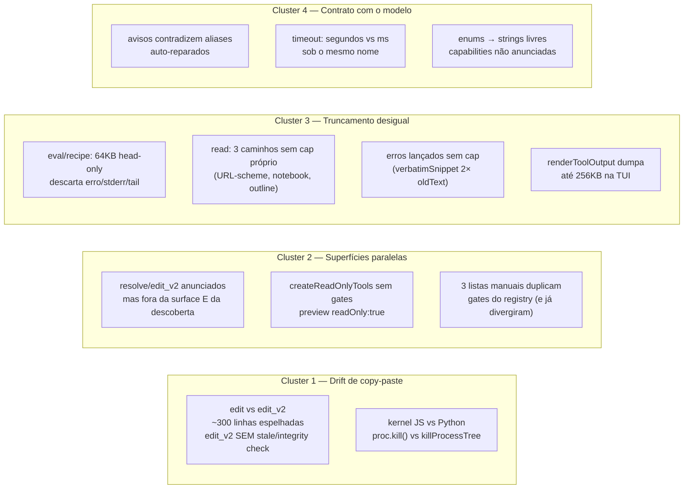
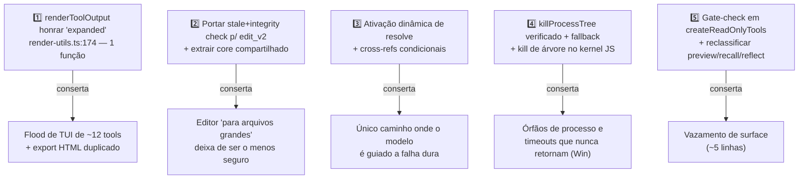

# Revisão Completa — Subsistema de Ferramentas (Tools) do PIT

> **Projeto:** pi-mono / `packages/coding-agent` (CLI `pit`)
> **Data:** 2026-07-03
> **Status: IMPLEMENTADO (2026-07-03)** — todos os achados foram implementados ou
> adjudicados em duas rodadas de agentes (implementação + auditoria-e-fechamento com
> portão de falso-positivo). Falsos positivos confirmados: `calc.precision` (bounds já
> existiam), `read_network.type` (case-insensitive já mitigado). Diferidos por contrato:
> renames de parâmetros (exceto `ask.timeout_ms`), extração completa do edit-core,
> derivação total das listas TUI/hindsight do registry (onda E estrutural). Bônus da
> auditoria: regressão do `tool-discovery.activate()` corrigida (idempotência), timeout
> na fila de mutação, e o fold do `isError` retornado no loop do agente
> (`agent-loop.ts`) — falhas retornadas agora contam para hints/doom-loop/modelo.
> **Natureza da revisão original:** 100% read-only — **nenhuma linha de código foi alterada**
> **Escopo:** `packages/coding-agent/src/core/tools/` (59 arquivos, ~18.400 linhas) + pontos de integração: registry, system prompt, TUI, kernels de eval, shell utils
> **Método:** 5 revisores especializados executados em paralelo (registry/wiring, ferramentas de filesystem, ferramentas de execução/runtime, superfície modelo-facing, ferramentas auxiliares/memória + rendering TUI), seguidos de spot-check direto e independente dos 3 achados-líder antes da publicação

---

## 1. Sumário Executivo

O subsistema de ferramentas do PIT é **arquiteturalmente sólido**: registry único com gates tipados, wrapper uniforme com rede de segurança de output, invariante de cache do system prompt respeitado, descoberta BM25 com auto-ativação, e o `bash` como implementação de referência (streaming, caps, temp file recuperável, races travadas).

Os problemas encontrados se concentram em **quatro clusters**, todos consequência de crescimento orgânico e não de design ruim:

1. **Drift de copy-paste entre pares de ferramentas** — `edit` vs `edit_v2` divergiram em recursos de *segurança* (stale-check, integrity-check); kernel JS vs Python divergiram em disciplina de kill de processo.
2. **Superfícies de ferramentas mantidas em listas paralelas** — o registry expressa gates, mas a TUI, o hindsight-scope e os seeds de descoberta mantêm listas manuais que já divergiram; resultado mais grave: o modelo é **ativamente instruído a chamar ferramentas inalcançáveis** (`resolve`, `edit_v2`).
3. **Disciplina de truncamento desigual** — o `bash` resolve o problema perfeitamente; `eval`, `recipe`, `chrome_devtools`, caminhos novos do `read` e **erros lançados** escapam para a rede genérica de 64KB head-only, que descarta exatamente a parte útil (tail/erro) e não oferece recuperação.
4. **Contrato modelo↔ferramenta com ruído** — avisos em descrições que contradizem o comportamento real (aliases auto-reparados), unidades de `timeout` inconsistentes, enums degradados a strings livres, capacidades implementadas mas nunca anunciadas.

**Balanço de severidade:** 3 críticos confirmados em primeira mão · 7 altos · ~20 médios · ~15 baixos · 6 lacunas de teste.

---

## 2. Escopo e Método

### 2.1 O que foi revisado

| Lane | Arquivos principais | Perguntas norteadoras |
|---|---|---|
| Registry & wiring | `index.ts` (899 ln), `tool-definition-wrapper.ts`, `argument-prep.ts`, `hindsight-scope.ts` | Consistência de gates, bypasses, contrato do wrapper |
| Filesystem | `read.ts`, `edit.ts`, `edit-diff.ts`, `edit-hashline*.ts`, `write.ts`, `grep.ts`, `find.ts`, `ls.ts`, `path-utils.ts`, `file-mtime-store.ts`, `file-mutation-queue.ts`, `truncate.ts` | Duplicação, staleness, truncamento, Windows |
| Execução/runtime | `bash.ts` (1159 ln), `eval.ts`, `code-mode.ts`, `debug.ts`, `chrome-devtools.ts`, `output-accumulator.ts`, kernels `javascript.ts`/`python.ts`, `utils/shell.ts` | Lifecycle de processos, caps efetivos, vazamentos |
| Modelo-facing | Descrições e schemas de ~50 tools, `system-prompt.ts`, `tool-discovery.ts` | Peso em tokens, coerência schema↔descrição↔comportamento, invariante de cache |
| Aux/memória + TUI | `recall/retain/forget/reflect/recipe`, `todo/plan/ask/resolve`, família ast-grep, `render-utils.ts`, `tool-execution.ts` | Cobertura de renderers, coerência da família de memória, código morto |

### 2.2 Confiabilidade dos achados

- ✅ **Confirmado** = verificado em primeira mão por leitura direta do código após o relatório do revisor (os 3 críticos).
- 📋 **Revisão** = achado de revisor com evidência `file:line` citada e coerente entre revisores independentes (vários achados foram corroborados por 2+ lanes sem coordenação).

---

## 3. Arquitetura do Subsistema

### 3.1 Pipeline de uma ferramenta (do factory ao terminal)

```mermaid
flowchart TD
    DEF["create*ToolDefinition()<br/>description + schema TypeBox + execute + renderCall/renderResult<br/>(1 arquivo por tool)"]
    REG["TOOL_REGISTRY<br/>index.ts:351-725<br/>{factory, definitionFactory, optionsKey, readOnly, coding-gate}"]
    DEF --> REG

    REG --> CODING["createCodingTools (SDK)<br/>index.ts:878-886<br/>✅ verifica codingGateOpen"]
    REG --> READONLY["createReadOnlyTools<br/>index.ts:888-892<br/>❌ filtra só readOnly, IGNORA gates"]
    REG --> TUI["_defaultActiveToolNames (TUI)<br/>agent-session.ts:1093-1124<br/>⚠️ lista MANUAL paralela ao registry"]

    CODING --> WRAP
    READONLY --> WRAP
    TUI --> WRAP

    WRAP["wrapToolDefinition<br/>tool-definition-wrapper.ts<br/>injeção de ctx + cap 64KB head-only<br/>(override headTail via withOutputCap)"]

    WRAP --> EXEC["execute()"]
    EXEC --> CAPS["Caps por tool:<br/>bash 24KB stream · debug 50KB tail<br/>recall 256KB headTail · eval SEM cap próprio"]
    CAPS --> MODEL["Texto para o MODELO"]
    EXEC --> ERR["Erros lançados<br/>❌ NUNCA capados"]
    ERR --> MODEL

    EXEC --> REND["renderCall / renderResult"]
    REND --> DISPATCH["ToolExecutionComponent<br/>tool-execution.ts:416-480<br/>extensão > built-in > fallback"]
    DISPATCH --> FALLBACK["Fallback (sem renderer):<br/>✅ colapsado em 15 linhas + hint"]
    DISPATCH --> CUSTOM["Renderer custom:<br/>⚠️ SEM cap por cima —<br/>renderToolOutput ignora 'expanded'"]

    HIDDEN["Tools ocultas → índice BM25<br/>tool-discovery.ts<br/>auto-ativação por nome exato"]
    REG -.seeds manuais<br/>agent-session.ts:1187-1194.-> HIDDEN

    style READONLY fill:#7a2b2b,color:#fff
    style ERR fill:#7a2b2b,color:#fff
    style CUSTOM fill:#7a5a2b,color:#fff
    style TUI fill:#7a5a2b,color:#fff
```

### 3.2 Mapa dos clusters de problemas



---

## 4. Achados Críticos — ✅ Confirmados em Primeira Mão

### 4.1 O modelo é guiado para ferramentas inalcançáveis (`resolve` / `edit_v2`)

**Evidência (verificada diretamente):**
- `edit-hashline.ts:334` — resultado devolvido ao modelo: `"Preview staged. id=... Use resolve to commit."`
- Schemas de `edit` (`edit.ts:63-66`), `write` (`write.ts:32-35`) e `ast_edit` (`ast-edit.ts:32-37, 210`) instruem: *"Use the resolve tool to commit"*.
- Descrição do `edit` (`edit.ts:332`): *"For very large files where output tokens matter, prefer `edit_v2`"*.
- **Porém** `agent-session.ts:1093-1121` (`_defaultActiveToolNames`) não inclui `resolve` nem `edit_v2` — nem no core, nem na lista gated — e `agent-session.ts:1187-1193` os **exclui do seed de descoberta BM25**, então o mecanismo de recuperação por nome exato (`buildHiddenToolHint`) também não funciona.

**Justificativa da severidade:** é o único lugar do subsistema onde o modelo é *ativamente* conduzido a uma falha dura (`unknown tool`), seguindo a própria documentação das ferramentas. Coerente apenas em builds SDK via `createCodingTools` (onde `resolve` é `coding:"always"`); incoerente na TUI, que é a superfície principal.

**Recomendação:** (a) ativar `resolve` dinamicamente quando a fila de preview tiver itens — o padrão "ativação dinâmica" já existe para `goal_complete` (`index.ts:552-556`); (b) tornar as cross-referências de descrição condicionais à superfície viva (as descrições são construídas por sessão nos factories — podem receber opção); ou (c) incluir `edit_v2`/`resolve` no índice de descoberta.

---

### 4.2 `createReadOnlyTools` ignora gates + classificações `readOnly` erradas

**Evidência (verificada diretamente):**

```ts
// index.ts:888-892 — filtra APENAS readOnly, nunca consulta codingGateOpen
export function createReadOnlyTools(cwd: string, options?: ToolsOptions): Tool[] {
	return toolNamesInOrder()
		.filter((name) => registry[name].readOnly)
		.map((name) => createTool(name, cwd, options));
}
```

Contraste com `createCodingTools` (`index.ts:878-886`), que verifica `entry.coding === false || !codingGateOpen(...)`.

**Consequências:**
1. 9 ferramentas `chrome_devtools_*` (todas `readOnly: true`, gate `chromeDevtools`) entram em **qualquer** superfície read-only mesmo com o feature desligado.
2. `preview` está registrado `readOnly: true` (`index.ts:704-709`) apesar de **subir um servidor HTTP local em porta efêmera e navegar o Chrome do usuário** (`preview.ts:1-12`) — efeitos colaterais reais classificados como leitura.
3. O inverso também ocorre: `recall` e `reflect` são leituras puras marcadas `readOnly: false` (`index.ts:503-516`), então superfícies read-only **perdem memória de recall sem motivo** — enquanto `find_symbol`/`repo_map`/`search_skills` estão corretamente `readOnly: true`.

**Recomendação:** aplicar `codingGateOpen` em `createReadOnlyTools`; reclassificar `preview → readOnly: false` e `recall`/`reflect → readOnly: true`. Mudança de ~5 linhas.

---

### 4.3 `edit_v2` é estritamente menos seguro que `edit` (drift de copy-paste)

**Evidência (verificada diretamente):** o caminho de execução de `edit-hashline.ts:303-353` vai de "conteúdo idêntico?" direto para `ops.writeFile` + `refreshHashlineMtime`, **sem**:

| Proteção | `edit` (tem) | `edit_v2` (não tem) |
|---|---|---|
| Stale-note quando o mtime mudou desde a última leitura | `edit.ts:460-471` | ausente |
| Verificação de integridade pós-write (tamanho) | `edit.ts:493-506` | ausente |

**Por que isso é grave especificamente no `edit_v2`:** os anchors de hash vêm de uma leitura *anterior*. Se o arquivo mudou externamente, janelas de 3 linhas idênticas podem casar em posições realocadas enquanto o conteúdo *entre* elas mudou — o `edit_v2` substitui silenciosamente conteúdo que o modelo nunca viu, sem qualquer aviso. E é exatamente a ferramenta recomendada para arquivos grandes, onde releitura é cara e edição externa concorrente é mais provável.

**Contexto estrutural:** ~300 das 468 linhas de `edit-hashline.ts` espelham `edit.ts` (scaffold de `execute`, `renderCall`, `renderResult`, componentes de preview — pares quase idênticos em `edit-hashline.ts:106-217` vs `edit.ts:209-324`). O drift de segurança é sintoma direto dessa duplicação.

**Recomendação:** (curto prazo) portar os dois blocos de proteção de `edit.ts:460-506`; (estrutural) extrair um `createAnchoredEditToolDefinition(engine)` parametrizado pelo engine de matching — `edit-preview-shared.ts` já é a semente natural desse seam.

---

## 5. Achados Altos 📋

| # | Achado | Evidência | Justificativa / Recomendação |
|---|---|---|---|
| 4 | **`renderToolOutput` ignora `options.expanded`** e sempre dumpa o output completo na TUI | `render-utils.ts:174-183` (`_options: unknown`); dispatch sem cap por cima em `tool-execution.ts:461-468` | Derrota o padrão collapsed-by-default para ~12 tools adotantes. Pior caso: `recall_tool_output`/`recall_history` pintam até **256KB** (`truncate.ts:27`) no transcript. Ironia: hoje uma tool SEM renderer é mais segura (fallback colapsa em 15 linhas, `tool-execution.ts:21,243-256`) do que uma que adota o helper compartilhado. **1 função corrigida conserta todas.** |
| 5 | **`ast_edit preview:true` sem fila ativa aplica em disco silenciosamente** | `ast-edit.ts:264-265` — `if (preview === true && queue)` cai no caminho `--update-all` | O modelo pediu explicitamente um preview e recebeu mutação em disco. Contraste: `resolve.ts:76-78` retorna "No preview queue active." Retornar erro ou degradar para `dry_run`. |
| 6 | **Kernel JS de eval órfã processos-netos** em timeout/abort/close | `javascript.ts:459, 475, 554, 572, 598` usam `proc.kill()`; só o caminho de flood usa `killProcessTree` (`:383`) | O kernel **Python no mesmo diretório** documenta e resolve exatamente esse hazard do Windows (`python.ts:352-357`) e usa `killProcessTree` em todos os caminhos. Espelhar (~10 linhas). |
| 7 | **`killProcessTree` no Windows é fire-and-forget sem verificação** → timeout do `bash` pode nunca retornar | `utils/shell.ts:180-198` — taskkill com erros engolidos (`killer.on("error", () => {})`), sem fallback; a rejeição de timeout só dispara após `waitForChildProcess` resolver (`bash.ts:452-470`) | Todo timeout/abort/shutdown do lane assume que o kill funcionou. Armar timer de verificação (~2s) com fallback `child.kill()`, e no `bash` corrida de graça pós-kill para o timeout ser garantia, não esperança. |
| 8 | **Output de `eval`/`code` sem cap próprio**: 64KB head-only descarta a seção `error` (que vem por último), sem persistência | `eval.ts:45-68` (ordem stdout→stderr→error), `tool-definition-wrapper.ts:69-74` (`truncateHead`); kernels capturam até 8MB (`javascript.ts:34`) | Script imprime >64KB e lança → o modelo vê `isError: true` **sem texto de erro**. E ao contrário do bash (temp file + `read`), os 8MB elididos são irrecuperáveis. Truncar por seção (tail-keep, nunca cortar `error`) num `formatKernelResult` compartilhado + spill em temp file. |
| 9 | **Descrições de `read`/`write` avisam contra aliases que o harness repara silenciosamente** | `write.ts:232-233` mostra `{"file_path": ...}` como WRONG; `PATH_KEY_ALIASES`/`EDIT_KEY_ALIASES` em `argument-prep.ts:100-124` absorvem exatamente isso | Texto factualmente errado sobre comportamento observável, residente no **prefixo cacheado de toda sessão** (~250 chars). Deletar os avisos, manter os aliases. |
| 10 | **`recipe` afunila 16MB de log pelo corte head-only de 64KB** → stderr e tail da falha somem primeiro | `recipe.ts:222` (maxBuffer 16MB), `:333-357` (stdout antes de stderr) + wrapper `truncateHead` | Falhas de build/teste vivem no tail/stderr — a parte descartada. Adotar `withOutputCap({mode:"headTail"})` como as recall tools, ou truncar por seção tail-biased. |

---

## 6. Achados Médios 📋 (agrupados por tema)

### 6.1 Staleness e serialização de arquivos

| Achado | Evidência |
|---|---|
| Chaves de `FileMtimeStore`/`ReadDedupeStore`/mutation-queue usam `absolutePath` cru em vez de `canonicalPathKey` (que existe em `path-utils.ts:26-35` e o read-guard **já usa**). No Windows: ler `C:\PiTest\Foo.ts` e editar `c:/pitest/foo.ts` → chaves diferentes → stale-detection e dedupe falham silenciosamente | `read.ts:777,822,842,872,1014`, `edit.ts:462`, `file-mutation-queue.ts:27-29` |
| `write` nunca consulta `mtimeStore.get()` antes de sobrescrever — a metade "write" do contrato documentado em `file-mtime-store.ts:2-10` não está implementada | `write.ts:317` (só refresh pós-write) |
| Closures de apply de preview bypassam a mutation queue E não re-verificam staleness no commit — o `finalContent` foi computado no *staging*, o commit sobrescreve cegamente o que estiver em disco | `edit.ts:432-434`, `edit-hashline.ts:319-322`, `write.ts:269-277` |
| Apply de preview do `edit` não refresca o mtime (o do `edit_v2` e `write` refrescam) → próximo edit após commit recebe stale-note **falso** do nosso próprio write | `edit.ts:432-434` vs `edit-hashline.ts:321` |
| Mutation-queue: chave não case-folded para arquivos ainda inexistentes no Windows; `resolve()` contra `process.cwd()` (footgun); sem timeout — um `writeFile` pendurado trava todas as mutações futuras do arquivo | `file-mutation-queue.ts:14-34, 57-60` |

### 6.2 Caps de output e caminhos ilimitados

| Achado | Evidência |
|---|---|
| 3 caminhos do `read` escapam do orçamento próprio (2000 linhas/50KB) e caem só na rede de 64KB **sem hint de recuperação por offset**: URL-scheme, notebook (fontes de célula ilimitadas — ex.: base64 embutido), outline | `read.ts:595-640`, `:854-876`, `:617-637`; `notebook-formatter.ts:15` (só *outputs* clipados a 1KB) |
| **Erros lançados nunca são capados** — o cap roda só no resultado resolvido; `verbatimSnippet` do edit-diff embute janelas do tamanho do `oldText` (até 2×) → um edit falho de 1000 linhas devolve ~2000 linhas de erro ao modelo | `tool-definition-wrapper.ts:97-101`, `edit-diff.ts:454, 470-479` |
| `chrome_devtools`: `limit` de schema até 1M chars é inalcançável (corte em 64KB com nota divergente); hint de recuperação "Re-fetch with a larger limit" é beco sem saída | `chrome-devtools.ts:218, 433, 545, 552` |
| `crushBashJsonOutput` lê o temp file **inteiro** em memória antes do gate de tamanho (alocação transitória de centenas de MB possível) | `bash.ts:872`; gate só em `json-crush.ts:55` |
| `debug` persiste o output **integral** (potencialmente MB) em `details` junto da sessão, além do texto capado em 50KB | `debug.ts:893, 846` |
| `render-mermaid` no fallback ecoa a **fonte inteira** (≤50KB) de volta ao modelo — que acabou de enviá-la; tokens em dobro por zero informação | `render-mermaid.ts:88-90, 102` |

### 6.3 Contrato modelo↔ferramenta (schemas e descrições)

| Achado | Evidência |
|---|---|
| **Armadilha de unidades**: `bash.timeout` = segundos, `debug.timeout` = segundos, `ask.timeout` = **milissegundos** — mesmo nome. Modelo que aprendeu segundos passa `30` ao ask e ganha auto-dismiss de 30ms | `bash.ts:49-53`, `debug.ts:133-135`, `ask.ts:66-68` |
| **camelCase vs snake_case rachado até dentro da mesma família**: `edit.oldText/newText` vs `edit_v2.before_hash/new_text`; grep `ignoreCase` vs plan `depends_on` etc. | `edit.ts:40-50` vs `edit-hashline.ts:38-46` |
| Enums degradados a strings livres onde há conjunto fechado: `recall.kinds` (typo `"decisions"` filtra para zero em silêncio — `coerceKinds` dropa inválidos sem feedback), `read_network.type`, `read_console.level` — enquanto `retain.kind`, `resolve.action`, `eval.lang` estão corretamente enumerados | `recall.ts:26-29, 68-77` vs `retain.ts:24`; `chrome-devtools.ts:122, 133-137` |
| Schemes `pr://`, `issue://`, `conflict://` **implementados e anunciados em lugar nenhum** — capacidade morta a menos que uma skill mencione | `read.ts:594-640`, `agent-session.ts:818-821`, `url-schemes/` |
| Política duplicada 2-3× (descrição + snippet + guideline) para bash/write/code/search_tool_bm25 — ~500-800 chars de prefixo cacheado por sessão sem ganho | `bash.ts:895-898` vs `system-prompt.ts:262`; `write.ts:233` vs `system-prompt.ts:313-315`; `code-mode.ts:123-124` vs `system-prompt.ts:236-238` |
| `debug`: descrição mais pesada do sistema (~2.100 chars) e ainda assim ~11 params avançados (memória/disassembly/data-breakpoints) existem **só** no schema; requiredness por action apenas em prosa + throws de runtime | `debug.ts:95-135, 483-515, 536` |
| `edit` afirma "File must be read first this session" mas a própria tool não impõe — só stale-note suave; enforcement real vive num guard externo do harness, então a afirmação é falsa para embedders SDK | `edit.ts:332, 459-467` |
| `ast_grep`: napi fast-path exige `lang` explícito, mas schema diz "Inferred from path when omitted" — o call shape mais comum sempre cai no CLI | `ast-grep.ts:189, 195, 232-236` |

**Peso das descrições (top 10, ~chars):** debug 2.100 · read 800 · edit 770 · bash 690 · grep 640 · write 600 · ast_grep 590 · message 530 · plan 510 · edit_v2 500. As `chrome_devtools_*` são exemplares (60-250 chars cada).

### 6.4 Registry, superfícies e opções

| Achado | Evidência |
|---|---|
| **3 listas manuais duplicam o que o registry expressa como gates** — e já divergiram: `grep/find/ls/repo_map` são `coding:false` no registry, então `createCodingTools` do SDK entrega um agente de código **sem grep/find/ls**, enquanto a TUI os inclui | `index.ts:387-407,422-427` vs `agent-session.ts:1093-1106`; também `hindsight-scope.ts:14` e seeds em `agent-session.ts:1187-1194` |
| Merge do `web_search.defaultProvider` só existe em `codingToolOptions` — `createTool`/`createToolDefinition`/`createAllTools` dropam a opção | `index.ts:809-817` vs `:860-899` |
| `createToolDefinitionFromAgentTool` dropa `outputCap` e `activity` no round-trip — overrides de base-tool de `recall_tool_output` revertem de 256KB headTail para 64KB head-only silenciosamente | `tool-definition-wrapper.ts:117-129`; hit em `agent-session.ts:4995-5001` |
| `hindsight-scope.makeScoped` reconstrói tools só com `{agentScope}`, descartando o override de `bank` que as quatro tools declaram | `hindsight-scope.ts:42-47` vs `recall.ts:47-50` |
| Gate `code` default-ON no SDK, mas a tool é não-funcional sem o dispatcher injetado pela sessão | `index.ts:530-536, 796-803` |
| `todo` e `plan` ambos `coding:"always"`, com o plan declarando que supersede o todo — duas tools de planejamento vivas custando dois blocos de descrição + guidelines duplicadas por sessão | `index.ts:560-573`, `plan.ts:108-117` |
| Bloco de exports `index.ts:1-209` divergiu: 7+ famílias registradas sem export público; famílias exportadas (calc/debug/code-mode/eval/recipe) consumidas em lugar nenhum — `src/index.ts:235-282` só re-exporta bash/edit/find/grep/ls/read/write/truncate | `index.ts:1-209` vs `src/index.ts:235-282` |

### 6.5 Windows e lifecycle

| Achado | Evidência |
|---|---|
| **ast-grep no Windows**: shim `.cmd` npm com `execFile shell:false` → EINVAL (Node ≥20.12) não capturado por `isMissingBinaryError` → exit tratado como sucesso → **"No matches found" em vez de erro**. `recipe.ts:169-175` já documenta e resolve esse exato problema | `ast-grep.ts:152-186`, `ast-edit.ts:78-112`, `ast-grep-shared.ts:4-9` |
| `bash` com `exitCode === null` (morto por sinal externo/OOM, não timeout) retorna output parcial como **sucesso**, sem flag nem status | `bash.ts:1082-1085` |
| Abort/timeout do `code` mata o kernel JS compartilhado e **apaga silenciosamente o estado persistente do `eval`** — acoplamento não documentado em nenhum dos dois schemas | `javascript.ts:565-576`, `eval.ts:25-27` |
| `forget` por id bypassa a cerca de `agentScope` que o caminho subject/tags impõe — subagente escopado pode deletar entrada de outro agente | `forget.ts:113-116` vs `:146-149` |
| `chrome_devtools.fail()` e retornos de erro do `web_search` **não setam `isError: true`** → toda falha parece sucesso para retry/loop-detection; mesmo padrão no `fail()` do `todo` (contraste: `plan` seta) | `chrome-devtools.ts:32-34`, `todo.ts:63-66` vs `plan.ts:100-104` |
| Glob-filter do backend fff usa `dot:false` enquanto rg passa `--hidden` → com engine fff, `grep glob:"**/*.yml"` dropa matches em dot-dirs (`.github/workflows/`) que o rg retorna — violação de paridade entre backends | `fff-search.ts:274` vs `grep.ts:583`, `find.ts:149-150` |

---

## 7. Achados Baixos 📋 (seleção)

- `EvalResult.value` é código morto — nenhum kernel o seta (`eval.ts:56`, `eval-kernel/types.ts:19`).
- Ring buffer de bg-jobs do bash: decode por chunk (`data.toString` quebra multibyte → U+FFFD), cap medido em UTF-16 code units, slice pode partir surrogate pair (`bash.ts:400-405`).
- ~30 one-liners `create*Tool` no registry que `buildTool` (`index.ts:746-749`) já obsoleta — as chrome tools já dropoaram os delas.
- `reuseText` exportado com **zero** adotantes; ~30 call sites re-implementam o idioma à mão (`render-utils.ts:155-157`).
- `resolveScope` duplicado byte a byte entre `recall.ts:53-66` e `reflect.ts:56-69`; `appendCappedStderr` duplicado entre `grep.ts:110-113` e `find.ts:52-55`; `refreshMtime` duplicado entre `write.ts:88-95` e `edit-hashline.ts:79-86`; `buildLocateOutput` re-implementado inline no close-handler do rg (`grep.ts:707-733`).
- `recall.limit` sem clamp superior (`recall.ts:122`); mensagens de "bank ausente" inconsistentes na família hindsight (só `retain.ts:76` tem hint de remediação); `forget` nunca é auto-adicionado a subagentes com memória (`hindsight-scope.ts:31`).
- Hint de continuação de notebook errado para offset além do fim — convite a retry infinito (`read.ts:861-865` + `notebook-formatter.ts:131-134`); leituras de notebook bypassam o dedupe (`read.ts:875` vs `:960`).
- `read` de diretório duplica semântica do `ls` sem tratamento de symlink `@` (`read.ts:196-228` vs `ls.ts:170-178`).
- `expandPath` produz separadores mistos no Windows (`path-utils.ts:104-106`); `resolveToolPath` trata `C:foo` drive-relative como absoluto (`argument-prep.ts:279-283`); `source-scan.ts` diz BFS mas faz DFS e `SCAN_SKIP_DIRS` não cobre `target`/`bin`/`obj`.
- `tool-discovery.activate()` nunca remove de `docs` → `listHidden()` superconta e `search()` re-sugere tools já ativas; contagem pré-marker de hidden tools lê um singleton process-wide ([INFERENCE] risco multi-sessão).
- Bounds ausentes em schema onde o runtime clampeia (`search_tool_bm25.limit`, `grep.limit`, `ast_grep.limit`, `calc.precision`); 4 fraseados diferentes para a mesma família de mensagem de sucesso ("replaced/applied/wrote N ...").
- `getShellEnv()` cacheado por vida do processo — mudanças de PATH mid-sessão não chegam aos filhos do bash (`utils/shell.ts:120-140`).
- Classificador de atividade do bash não vê command substitution — `echo $(rm -rf x)` classifica como "navigation" (display-only, `bash-activity.ts:113-125`).

---

## 8. Pontos Fortes (manter como referência de design)

| Componente | Por quê |
|---|---|
| **`bash.ts` + `output-accumulator.ts`** | Padrão-ouro do sistema: decode streaming com TextDecoder, caps 24KB/1000 linhas com composição head+tail, persistência em temp file recuperável via `read`, upgrade estrutural via json-crush, races de promotion/abort explicitamente travadas, pids rastreados para o reaper |
| **`truncate.ts`** | Fast paths sem alocação, `truncateLine` centrado no match, variantes head/tail/headTail — nenhum problema encontrado |
| **`python.ts` (kernel)** | Disciplina de kill exemplar, com o racional do Windows escrito no código — é o template para consertar o kernel JS |
| **`symbol.ts`** | Melhor UX de erro do repo: OOM guard, truncamento com hints de recuperação, sinalização de ambiguidade, did-you-mean |
| **`argument-prep.ts`** | Preparadores conservadores e bem documentados; postura de falha sonora correta |
| **Invariante de cache do system prompt** | **PASSA** na auditoria: todo conteúdo por-turno/por-sessão vem após `SYSTEM_PROMPT_DYNAMIC_MARKER` (`system-prompt.ts:145-201`) |
| **Descoberta BM25** (`tool-discovery.ts`) | Tokenização camel-aware, guidelines alimentadas como tags para recall, auto-ativação por nome exato como recuperação — excelente |
| **Lifecycle DAP/CDP** | Reapers de idle, dispose no teardown da sessão, eviction de sockets mortos, pids rastreados — genuinamente limpo |
| **`lazy-omission`, `calc`, `json-crush`** | Guards de backtracking, parser sem `eval()`, contrato documentado e bem testado (json-crush **não** é código morto: 5 pontos de integração vivos) |

**Vereditos de sobreposição:** `symbol` vs `find_symbol` = complementares, manter ambos. `json-crush` = biblioteca viva, manter. `todo` vs `plan` = sobreposição real, decisão de consolidação pendente.

---

## 9. Lacunas de Teste (anotadas, não escritas)

1. `reflect.ts` sem teste direto (loop drop-oldest de `packResults` inexercitado).
2. Caminhos de execute do `ast-edit` (dry_run/preview/apply, refusal de overflow, fallthrough preview-sem-fila) sem teste.
3. `render-utils.ts` sem teste unitário (`shortenPath` Windows-aware, `renderToolOutput`).
4. Nenhum teste para fallback de falha do taskkill (o fallback nem existe).
5. Sobrevivência da seção de erro do eval >64KB; `bash exitCode === null`; abort do code-mode apagando estado do eval.
6. Cobertura existente **boa**: accumulator head+tail, promotion, races abort-vs-promotion, hindsight scope, json-crush.

---

## 10. Plano de Ação Recomendado (por custo/benefício)



**Sequência sugerida (ondas independentes):**

| Onda | Itens | Esforço | Risco |
|---|---|---|---|
| A — cirúrgicos | #5 gates read-only · flags `isError` (chrome/web_search/todo) · guard do `ast_edit preview` · enums (`recall.kinds`, chrome) · deletar avisos de alias | Baixo | Mínimo |
| B — segurança de edição | stale+integrity no `edit_v2` · `write` consultar mtime · chaves `canonicalPathKey` · apply de preview via mutation queue | Médio | Baixo (aditivo) |
| C — output | `renderToolOutput` expanded · `formatKernelResult` compartilhado com tail-keep + spill · headTail no `recipe` · cap de erros lançados no wrapper · 3 caminhos do read | Médio | Baixo |
| D — Windows/lifecycle | `killProcessTree` verificado · kernel JS → `killProcessTree` · EINVAL no ast-grep via estratégia do recipe · `exitCode === null` | Médio | Testar em Win |
| E — estrutural | Core compartilhado edit/edit_v2 · derivar listas TUI/hindsight/seeds do registry · dedup de política descrição/guideline · decisão todo-vs-plan · limpeza de exports | Alto | Requer decisão de design |

---

## Apêndice A — Critérios de Severidade

- **CRÍTICO/ALTO** — corrupção silenciosa de dados, falha dura induzida pelo próprio sistema, vazamento de recursos, perda da informação mais útil (erro/tail), vazamento de surface com efeitos colaterais.
- **MÉDIO** — inconsistência que causa misfires do modelo, gasto de token cacheado, contrato quebrado entre camadas, divergência Windows/POSIX.
- **BAIXO** — duplicação, código morto, polish de mensagens, bounds de schema, cosmético.

## Apêndice B — Artefatos e Rastreabilidade

| Lane | Artefato | Duração |
|---|---|---|
| Registry & wiring | `agent://RegistryReview` | 7m47s |
| Filesystem | `agent://FsToolsReview` | 5m53s |
| Execução/runtime | `agent://ExecToolsReview` | 7m28s |
| Modelo-facing | `agent://ModelFacingReview` | 10m01s |
| Aux/memória + TUI | `agent://AuxAndRenderReview` | 6m54s |

**Correção de memória institucional:** a nota "default renderer dumps full text" está desatualizada — o fallback atual colapsa em 15 linhas + hint de expansão (`tool-execution.ts:21, 243-256`); o footgun real migrou para `render-utils.ts:renderToolOutput`.

**Spot-checks de confirmação (leitura direta pós-revisão):** `index.ts:698-725, 878-899` · `agent-session.ts:1090-1125` · `edit-hashline.ts:289-363`.

---

*Documento gerado por revisão read-only em 2026-07-03. Nenhuma alteração foi aplicada ao código.*
