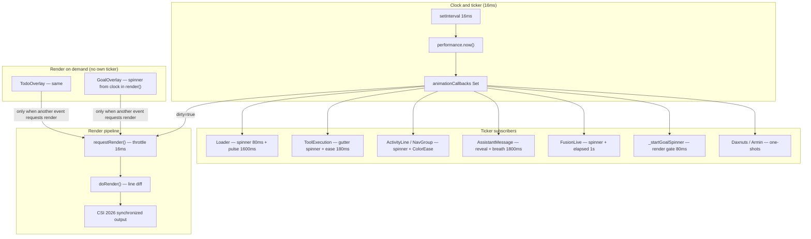

# CLI motion & animation subsystem

> Part of the canonical chain: source of truth is [`AGENTS.md`](../../AGENTS.md).
> Companion: [`already-built.md`](already-built.md) (inventory — motion is listed there too).
> Read this before proposing spinner unification, render coalescing, reduced-motion flags,
> or overlay enter/exit — those mechanisms largely exist.

Initial audit: 2026-06-29. Revalidated against the codebase: 2026-06-29. Covers
`@pit/tui` (render engine) and `@pit/coding-agent` (interactive-mode components).
Documentation only — no runtime changes in either pass.

---

## Pipeline (end to end)

```
Business event (tool start, stream delta, goal active)
  → component updates internal state
  → addAnimationCallback OR render() with clock-derived frame
  → callback returns true only when visible bytes changed
  → tickAnimations() → requestRender() (throttled to ≤16ms)
  → component tree render()
  → doRender() differential diff (ideal: last line only on steady-state spinner)
  → terminal.write with CSI 2026 synchronized output
```



**Golden rule (already encoded):** derive spinner frames from `performance.now()` via the
shared ticker — never from a local frame counter — so every live spinner stays phase-locked.

---

## Core constants

Defined across `@pit/tui` and interactive components (not yet centralized in one module):

| Constant | Value | Location | Role |
|-|-|-|-|
| `ANIMATION_FRAME_MS` | 16ms | `packages/tui/src/tui.ts` | Global animation tick (~60fps) |
| `MIN_RENDER_INTERVAL_MS` | 16ms | `packages/tui/src/tui.ts` | `requestRender()` coalescing |
| `SPINNER_FRAME_MS` | 80ms | `packages/tui/src/components/loader.ts` | Unified spinner cadence (~12.5fps) |
| `SPINNER_FRAMES` | braille ⠋…⠏ | `packages/tui/src/components/loader.ts` | Single spinner identity (P7) |
| `PULSE_CYCLE_MS` | 1600ms | `packages/tui/src/components/loader.ts` | Loader color breath cycle |
| `COLOR_EASE_MS` | 180ms | `packages/coding-agent/.../color-ease.ts` | Icon/gutter settle fade |
| `GUTTER_EASE_MS` | 180ms | `packages/coding-agent/.../tool-execution.ts` | Gutter color settle |
| `THINKING_BREATH_MS` | 1800ms | `packages/coding-agent/.../assistant-message.ts` | "Thinking…" pulse |
| `GOAL_COMPLETE_LINGER_MS` | 4000ms | `packages/coding-agent/.../goal-overlay.ts` | Completed goal overlay linger |

**Animation callback contract** (`packages/tui/src/tui.ts`):

- Invoked once per tick with `now = performance.now()`.
- Return `true` only when visible output changed this frame.
- The ticker schedules at most one `requestRender()` per frame when any callback is dirty.
- Throwing callbacks are isolated; a transient `! animation error: …` line is shown
  (`packages/tui/test/tui-animation-isolation.test.ts`).

---

## Surface inventory

| Surface | Animation type | Driver | Cadence / duration |
|-|-|-|-|
| Working loader | Spinner + color breath | `Loader` + `workingPulsePalette()` | 80ms / 1600ms (24 truecolor phases) |
| Bash execution | Spinner in status row | `Loader` | 80ms + pulse |
| Tool gutter (expanded shell) | Spinner + color fade | `addAnimationCallback` | 80ms / 180ms smoothstep |
| Activity line / Nav group | Spinner + icon crossfade + counter ease | `createSpinnerTicker` + `ColorEase` | 80ms / 180ms |
| Assistant streaming | Reveal cursor + tail gradient | `revealTick` | ~130ms catch-up (8 frames) |
| "Thinking…" label | Dim ⇄ normal breath | `breathUnsub` | 1800ms, 8 buckets |
| Deliverable glyph | One-shot `ColorEase` | `ColorEase` | 180ms |
| Todo overlay | Spinner on `in_progress` row | Clock in `render()` | 80ms when a render happens |
| Goal overlay | Spinner in "working…" hint | Clock in `render()` + `_startGoalSpinner` | 80ms while goal `active` |
| Fusion live strip | Spinner + per-second clocks | Dedicated ticker | 80ms + 1s |
| Goal footer status | Spinner between autonomous turns | `_startGoalSpinner` | 80ms |
| Countdown dialogs | Second countdown | **Own** `setInterval(1000)` | Outside shared ticker |
| Easter eggs (Daxnuts, Armin) | Custom reveal | Shared ticker | One-shot ~2s |

Key files:

- Ticker + diff: `packages/tui/src/tui.ts`
- Loader + shared frames: `packages/tui/src/components/loader.ts`
- Spinner helper: `packages/coding-agent/src/modes/interactive/components/spinner-ticker.ts`
- Color ease: `packages/coding-agent/src/modes/interactive/components/color-ease.ts`
- Truecolor interpolation: `packages/coding-agent/src/modes/interactive/theme/color-interpolation.ts`
- Working palette: `packages/coding-agent/src/modes/interactive/components/working-palette.ts`
- Goal spinner subscription: `packages/coding-agent/src/modes/interactive/interactive-mode.ts` (`_startGoalSpinner`)

---

## Two animation drivers

The codebase uses two patterns side by side:

### 1. Ticker subscribers

Components register `ui.addAnimationCallback()`. When any callback returns `true`, the TUI
requests a render. Examples: `Loader`, `ToolExecutionComponent`, `FusionLiveComponent`,
`AssistantMessageComponent` (reveal/breath), `_startGoalSpinner`.

### 2. Clock-on-render

Components derive the spinner frame inside `render(width)` from an injected clock
(default `performance.now()`). They animate **only when something else already triggered a
render**. Examples: `TodoOverlayComponent`, `GoalOverlayComponent` (partial — see below).

**Intentional asymmetry** (`interactive-mode.ts`, comment on `_startGoalSpinner`):

- **Goal overlay / footer:** while `status === "active"`, `_startGoalSpinner` keeps the
  spinner moving even between autonomous turns (no other UI activity).
- **Todo overlay:** spinner advances via natural renders during agent work; stays static
  when idle — treated as an honest "not working" signal.

Paused / budget-limited / complete goals do not run the goal spinner ticker; complete
goals linger `GOAL_COMPLETE_LINGER_MS` then disappear with no exit transition.

---

## Reduced motion

`isReducedMotion()` in `packages/coding-agent/src/utils/env-flags.ts` is true when:

- `PIT_NO_MOTION=1` / `true` / `yes`
- `PIT_REDUCED_MOTION=1` / `true` / `yes`
- `TERM=dumb`

When active:

- Color breathing, settle eases, icon crossfade, thinking pulse, and streaming reveal snap
  to their end state.
- **The spinner glyph keeps rotating** — only cosmetic motion stops.

Truecolor-only eases (`interpolateFg`) also snap on 256-color terminals regardless of the
flag.

---

## What already works well

1. **Phase lock (P7)** — One glyph set, one interval, one monotonic clock. Tested in
   `packages/coding-agent/test/spinner-cadence.test.ts`.
2. **Differential render fast path** — When only the last line changes (typical spinner
   tick), diff scan is O(1) prefix check then single-line update (`tui.ts`).
3. **Synchronized output** — CSI 2026 wraps updates to reduce flicker.
4. **Lifecycle / leak prevention** — `dispose()` on activity lines, nav groups, tool rows,
   assistant messages; tests in `activity-ticker-leak.test.ts`,
   `interactive-mode-ticker-leak.test.ts`.
5. **Settle polish** — Spinner→✓/✗ crossfade holds the last spinner glyph through the
   first half of `ColorEase` (`activity-line.ts`, `nav-group.ts`).
6. **Streaming smoothing** — Proportional catch-up, grapheme-aware `fadeLineTail`, heavy
   memoization when animations are idle (`assistant-message.ts`).
7. **Perf on long transcripts** — Settled-line caches, target cache during pending spinner,
   TUI `resetCache` reference-identity fast path.
8. **Terminal capability fallbacks** — Truecolor breathing vs 256-color discrete pulse
   (`working-palette.ts`); no forced banding.

**Gold-standard patterns to copy** (already implemented elsewhere — do not re-invent):

- **`Loader.tick()`** — triple gate (frame, palette phase, elapsed second) before returning
  dirty (`packages/tui/src/components/loader.ts`).
- **`revealTick()`** — returns `false` when already caught up (`assistant-message.ts`).
- **`ThinkingLabelComponent` / breath ticker** — 8 buckets; skip render when bucket unchanged.
- **`FusionLiveComponent.tick()`** — coalesces on `frameIdx` + per-second `elapsedKey`
  (`fusion-live.ts`); dispose tested in `fusion-live.test.ts`.

---

## Known gaps and inconsistencies

| Issue | Detail | Anchor | Revalidation note |
|-|-|-|-|
| ~~Dual `requestRender` on spinner tick~~ | ~~`createSpinnerTicker` + `onFrame` both scheduled renders~~ | `activity-line.ts`, `nav-group.ts` | **Fixed (#D):** `onFrame` updates state only; `tickAnimations` dirty bit drives render. |
| ~~`ColorEase` dual dirty path~~ | ~~`tick()` called `onFrame()` and always `return true`~~ | `color-ease.ts`, `tool-execution.ts` | **Fixed (#A):** `onFrame()` only on snap; `tick()` dirty-gated (probe + 0.5 half). `gutterEaseTick` probe-gated. |
| Timing constants scattered | No `motion-tokens` module | see constants table | Still true; DX refactor, not user-facing. |
| `CountdownTimer` off-ecosystem | Own 1s `setInterval` (retry + extension dialogs) | `countdown-timer.ts` | Acceptable — 3 call sites, modal/infrequent. **Do not unify** unless profiling proves pain. |
| Mixed clocks | `performance.now()` for frames, `Date.now()` for elapsed | `fusion-live.ts` | Intentional; comments in source are authoritative. |
| No overlay enter/exit motion | Todo/Goal snap in/out (goal complete has soft-exit `✓` hint — #F) | `goal-overlay.ts`, `todo-overlay.ts` | Enter animation still a gap; exit polish partially addressed (#F). |
| ~~Partial reduced motion~~ | ~~Glyph still spun under `isReducedMotion()`~~ | `env-flags.ts`, `spinner-ticker.ts`, `loader.ts` | **Fixed (#E):** glyph frozen to frame 0; elapsed/metrics still tick. |
| Uneven test coverage | Overlay enter/exit; reduced-motion glyph freeze; `PIT_ANIM_PROFILE` harness | — | `#B` `_startGoalSpinner`, `#A` `ColorEase` dirty gating, `#C`/`#G` covered (2026-06-29). |

---

## Revalidation (2026-06-29)

Code walk comparing this doc to the tree. **Verdict:** inventory and architecture are
accurate; the original Tier 1 ranking **overstated** spinner `requestRender` duplication
(coalescing absorbs it) and **understated** `ColorEase` (dual dirty path, not just missing
buckets).

### Confirmed implemented (not backlog)

| Claim | Evidence |
|-|-|
| P7 phase-lock | `spinner-cadence.test.ts` |
| Goal spinner between autonomous turns | `_startGoalSpinner` bucket gate (`interactive-mode.ts`) |
| Todo spinner only on natural renders | Explicit product comment; no `_startTodoSpinner` |
| Fusion animation + dispose | `fusion-live.ts` + `fusion-live.test.ts` |
| Partial measurement hooks | `getDiffScanCountForTest()`, `getResetCacheSizeForTest()` (`tui.ts`) |
| `requestRender` coalescing | `renderRequested` flag + `MIN_RENDER_INTERVAL_MS` (`tui.ts`) |

### Original backlog items — keep / change / drop

| Original # | Verdict | Reason |
|-|-|-|
| 1 Remove spinner `onFrame` `requestRender` | **Keep → Tier 2 (hygiene)** | Coalesced; contract cleanup, not perf win |
| 2 `ColorEase` bucketing | **Keep → Tier 1 (raised)** | Add: stop calling `onFrame()` from `tick()`; reserve `onFrame` for snap in `begin()` only |
| 3 `motion-tokens.ts` | **Keep → Tier 3** | DX only; bundle with ease refactor if touched |
| 4 `_startGoalSpinner` test | **Keep → Tier 1** | Still missing |
| 5 Todo overlay ticker | **Drop** | Intentional idle-static signal; revisit only on user feedback |
| 6 Goal complete soft exit | **Keep → Tier 2 (simplified)** | Single-line `✓` hint in last ~300–500ms, not overlay fade |
| 7 Overlay enter animation | **Drop** | Low ROI; breaks overlay render caches |
| 8 Freeze glyph under reduced motion | **Keep → Tier 2** | `loader.ts`, overlays, `spinner-ticker.ts` |
| 9 Countdown → shared ticker | **Drop** | Rare modals; separate 1s cadence is fine |
| 10 `deriveSpinnerFrame(now)` | **Keep → Tier 3** | With motion-tokens if ever extracted |
| 11 `PIT_ANIM_PROFILE=1` | **Keep → Tier 3** | Wire existing test hooks; no new metrics |
| 12 `diffScanCount` bench | **Keep → Tier 2 (raised)** | Last-line fast path untested despite being critical |

### Feel tuning

Do **not** change `SPINNER_FRAME_MS` (or other cadence constants) without re-running
`spinner-cadence.test.ts` and a visual pass — P7 tests assume 80ms across the whole UI.

---

## Prioritized improvement backlog (revised)

Supersedes the initial 2026-06-29 tier list. Not scheduled work.

### Tier 1 — do first

| ID | What | Files |
|-|-|-|
| ~~A~~ | **Done** — `ColorEase` dirty gating + `gutterEaseTick` probe gate; `onFrame()` snap-only | `color-ease.ts`, `tool-execution.ts`, `color-ease.test.ts` |
| ~~B~~ | **Done** — `_startGoalSpinner` harness: bucket gate, idempotent start, inactive unsubscribe | `packages/coding-agent/test/goal-spinner-ticker.test.ts` |
| ~~C~~ | **Done** — last-line fast path: `diffScanCount === N-1`; non-tail baseline: `=== N` | `packages/tui/test/render-perf-guards.test.ts` |

### Tier 2 — if time remains

| ID | What | Files |
|-|-|-|
| ~~D~~ | **Done** — removed redundant `requestRender()` in `createSpinnerTicker` `onFrame` | `activity-line.ts`, `nav-group.ts`, `spinner-ticker.test.ts` |
| ~~E~~ | **Done** — reduced motion freezes spinner glyph; Loader elapsed ticks on single frame | `loader.ts`, `spinner-ticker.ts`, overlays, loaders |
| ~~F~~ | **Done** — complete hint gets `✓` prefix in final `GOAL_COMPLETE_SOFT_EXIT_MS` | `goal-overlay.ts`, `goal-overlay.test.ts` |
| ~~G~~ | **Done** — tick coalescing: `false` on same frame/elapsed; `true` on `SPINNER_FRAME_MS` step | `packages/coding-agent/test/fusion/fusion-live.test.ts` |

### Tier 3 / dropped

| ID | Verdict |
|-|-|
| H `motion-tokens.ts` | Tier 3 — only with ease/token refactor |
| I `deriveSpinnerFrame(now)` export | Tier 3 — bundle with H |
| J `PIT_ANIM_PROFILE=1` | Tier 3 — log `diffScanCount`, active callbacks, `fullRedraws` via existing test hooks |
| K Todo overlay ticker | **Dropped** — product decision |
| L Overlay enter animation | **Dropped** — cost > benefit |
| M `CountdownTimer` → shared ticker | **Dropped** — 1 Hz modals |

### Feel tuning (preference, not bugs)

| Parameter | Current | Alternative | Effect |
|-|-|-|-|
| `SPINNER_FRAME_MS` | 80ms | 100ms | Calmer spinner (~10fps) |
| `PULSE_CYCLE_MS` | 1600ms | 2000ms | Slower working-loader breath |
| `THINKING_BREATH_MS` | 1800ms | 1600ms | Align with loader pulse |
| `REVEAL_CATCHUP_FRAMES` | 8 | 5 | Snappier streaming text |
| `GOAL_COMPLETE_LINGER_MS` | 4000ms | 2500ms | Faster overlay dismiss |

Measure before changing: `scripts/check-token-bench.mjs`, `packages/tui/test/render-perf-guards.test.ts`.

---

## Implementation guide (difficulty & pitfalls)

Use this section when picking up backlog items A–G. Ratings: **S** (≤1h, low risk),
**M** (half day, some integration), **L** (1–2 days, cross-package or subtle regressions).
**Risk** is behavioral regression visibility, not line count.

**Recommended order:** **C** and **G** first (tests only, document current behavior) → **A**
(behavior change) → **D** (cleanup after A proven) → **B** → **E** → **F**. Do **not** batch
A with H/I (token extraction) — different failure modes.

### ~~A~~ — `ColorEase` + `gutterEaseTick` dirty gating (**Done**)

| | |
|-|-|
| **Difficulty** | **L** |
| **Risk** | **High** on truecolor terminals; **Low** in CI (most tests pin `trueColor: false`) |
| **Files** | `color-ease.ts` (core), `tool-execution.ts` (`gutterEaseTick`), optionally simplify `onFrame` at call sites |

**What to implement**

1. `ColorEase.tick()`: remove `this.onFrame()` from the hot path.
2. Keep `this.onFrame()` **only** in `begin()` when snapping (`isReducedMotion()` or
   `!interpolateFg(...)`) — that path has **no** animation callback; something must still
   schedule a render.
3. Return `true` from `tick()` only when visible output would change. Mirror `Loader.tick()`:
   compose a probe string (e.g. `colorize(steady, "█")`) and compare to `lastProbe`; or
   quantize `eased` to ~6 steps over 180ms.
4. `gutterEaseTick`: cache last gutter color fn or probe ANSI from `interpolateFg`; return
   `false` when quantized `eased` unchanged. Still call `setGutterColor` only when dirty
   (avoids `bustMemo()` no-ops).

**Call sites (do not break)**

| Consumer | `onFrame` today | Special render logic |
|-|-|-|
| `activity-line.ts` | `requestRender` | `iconEase.progress < 0.5` swaps spinner glyph → ✓/✗ |
| `nav-group.ts` | `requestRender` ×2 | Same icon crossfade + `countEase` on coalesce |
| `assistant-message.ts` | `requestRender` | `deliverableEase`; `canMemoizeDecorations()` returns false while ease active |

**Pitfalls**

- **0.5 progress crossfade:** `activity-line` / `nav-group` switch the **glyph** at
  `progress >= 0.5` even if color barely moved. Dirty gate must return `true` when
  `eased` crosses `0.5` (or when `floor(eased * 2)` changes), not only on color steps.
- **Snap path:** If `begin()` stops calling `onFrame()` after refactor, settled lines never
  repaint on 256-color / reduced-motion — visual snap must still trigger one render.
- **Cache flags:** `linesCache` / `cacheable` use `iconEase.active` — easing must stay
  `active` until `stop()` even when returning `false` from intermediate ticks.
- **CI blind spot:** `activity-ticker-leak.test.ts` forces `trueColor: false`, so
  `ColorEase` never arms in those runs. Add or extend `color-ease.test.ts` with
  `setCapabilities({ trueColor: true })` and a tracking TUI that counts `requestRender`
  during a 180ms ease (expect ≪ 11 renders).
- **`gutterEaseTick` is not `ColorEase`:** duplicate the gating logic or extract a shared
  `easeStepDirty(last, eased, steps)` helper in `color-interpolation.ts` — do not call
  `ColorEase` from the gutter (different target: `setGutterColor` vs `colorize()`).

**Verify**

- `npm run check`
- Manual: settle a tool row on a truecolor terminal — icon crossfade must still read smooth.
- Assert render count drops on eased settle (new unit test).

---

### ~~B~~ — `_startGoalSpinner` integration test (**Done**)

| | |
|-|-|
| **Difficulty** | **M** |
| **Risk** | **Low** (test-only) if scoped correctly; **High** if booting full `InteractiveMode` |
| **Files** | New `packages/coding-agent/test/goal-spinner-ticker.test.ts` (suggested name) |

**What to implement**

Test the **callback contract**, not the whole interactive session:

1. `trackingTui()` with `requestRender` counter + `addAnimationCallback` registry (copy
   `activity-ticker-leak.test.ts`).
2. Minimal `fakeThis`: `{ session: { goalSnapshot: () => snap }, ui, _goalSpinnerBucket: -1 }`.
3. Invoke via `Reflect.get(InteractiveMode.prototype, "_startGoalSpinner")` and
   `_stopGoalSpinner` — same pattern as `interactive-mode-ticker-leak.test.ts`.
4. Drive `tickAll(0)`, `tickAll(79)`, `tickAll(80)`: expect render intent only when bucket
   changes; expect callback removed when `goalSnapshot().status !== "active"`.

**Pitfalls**

- **Do not** construct real `InteractiveMode` (stdin, session FS, extensions) — slow and flaky.
- Callback returns `true` but does not call `requestRender` itself — count renders only if
  you wire `trackingTui.requestRender` to increment; the real TUI calls it from
  `tickAnimations()` when any callback returns `true`. Test should mirror that:
  `if (cb(now)) renders++`.
- **`_startGoalSpinner` is idempotent** — second call must not register duplicate callbacks.
- Goal overlay spinner also needs renders from this ticker — test is about the **subscription**,
  not pixel output of `GoalOverlayComponent` (that is clock-on-render + this ticker).

**Verify**

- Vitest file green in isolation; full `npm run check`.

---

### C — Last-line `diffScanCount` regression test

| | |
|-|-|
| **Difficulty** | **M** |
| **Risk** | **Low** (test-only); false positive if setup triggers width/height change |
| **Files** | `packages/tui/test/render-perf-guards.test.ts` |

**What to implement**

1. `CollectTerminal` + `TUI` + `LinesComponent` with **N** stable lines (reuse existing harness).
2. `render(tui)` once to populate `previousLines`.
3. Mutate **only** the last line string (new array reference, same length N).
4. `render(tui)` again; assert `tui.getDiffScanCountForTest() === N - 1` (fast path walks
   the unchanged prefix only). Contrast test: change line `0` with the tail identical —
   expect `=== N` (full-frame scan, no fast path).

**Pitfalls**

- **`@pit/tui` uses `node:test`**, not vitest — match the file's existing import style.
- Fast path requires `prevLen === newLen` **and** only last line differs. Adding/removing
  lines forces full O(N) scan — not a failure, wrong test setup.
- Call `doRender` via the existing `render(tui)` helper (`(tui as unknown as { doRender() })`).
- `diffScanCountForTest` resets to `0` at the start of each `doRender` — read it **after**
  the second render.
- Changing terminal **width** between frames invalidates the test (`widthChanged` → full redraw).

**Verify**

- `node --test packages/tui/test/render-perf-guards.test.ts` (or full check).

---

### ~~D~~ — Remove spinner `onFrame` `requestRender` (**Done**)

| | |
|-|-|
| **Difficulty** | **S** |
| **Risk** | **Low** |
| **Files** | `activity-line.ts:115`, `nav-group.ts` (~77) |

**What to implement**

Delete `this.ui.requestRender()` inside `createSpinnerTicker` `onFrame` callbacks. State
updates (`spinnerGlyph`, `lastSpinnerGlyph`, ticker stop) stay.

**Pitfalls**

- Do **after A** or in parallel only if spinner behavior is already green — if you remove
  `requestRender` while `createSpinnerTicker` accidentally stops returning `true`, spinners
  freeze with no other signal.
- `iconEase` / `countEase` still use `onFrame: () => requestRender` until A refactors them.

**Verify**

- `spinner-ticker.test.ts`, activity/nav component tests, one manual pending tool row.

---

### ~~E~~ — Reduced motion: freeze spinner glyph (**Done**)

| | |
|-|-|
| **Difficulty** | **M–L** |
| **Risk** | **Medium** — package boundary + product ambiguity |
| **Files** | `loader.ts`, call sites (`interactive-mode.ts` `createWorkingLoader`, `bash-execution.ts`,
  `bordered-loader.ts`), `spinner-ticker.ts` or overlays — **not** `env-flags.ts` inside `@pit/tui` |

**What to implement**

`@pit/tui` must **not** import `@pit/coding-agent` env flags. Options (pick one):

1. **Call-site policy (preferred):** when `isReducedMotion()`, pass
   `LoaderIndicatorOptions { frames: [SPINNER_FRAMES[0]] }` or a static `"…"` — Loader already
   skips animation subscription when `frames.length <= 1` but **elapsed** still updates via
   `refreshElapsed` only if subscribed — check `loader.ts`: single frame → no `subscribeAnimation`
   → elapsed won't tick. May need Loader change: allow elapsed without frame animation.
2. **Inject optional `freezeAnimation?: boolean`** on Loader construction from coding-agent only.
3. Overlays (`todo-overlay`, `goal-overlay`): use fixed glyph when flag set (pure render change).
4. `createSpinnerTicker`: optional `freezeFrame` parameter returning constant glyph.

**Pitfalls**

- **Elapsed counter on working loader** must keep updating under reduced motion — do not
  disable the ticker entirely; freeze **frame index** only (Loader may need a dedicated
  elapsed-only subscription path).
- **P7 phase-lock** irrelevant when frozen — acceptable.
- **`workingPulsePalette`** already returns single accent phase — colors already correct.
- Test with `PIT_NO_MOTION=1` in subprocess or env in test — reset env after.

**Verify**

- Working loader shows static glyph + live elapsed; goal/todo overlays static `in_progress` glyph.
- `spinner-cadence.test.ts` still passes when motion **on**.

---

### ~~F~~ — Goal complete hint soft exit (**Done**)

| | |
|-|-|
| **Difficulty** | **S–M** |
| **Risk** | **Low** |
| **Files** | `goal-overlay.ts` (`hintForStatus`, `buildGoalHintLine`, `render`) |

**What to implement**

Thread `completeAgeMs` into hint building. When `status === "complete"` and
`completeAgeMs > GOAL_COMPLETE_LINGER_MS - 400` (example), prefix hint with `✓` or swap to
a static success string. `materializeGoalOverlayCache` **already rebuilds the hint line** on
every cache hit — safe to vary hint without busting structural cache.

**Pitfalls**

- Do **not** add `completeAgeMs` to `goalStructuralKey` unless metrics/hint share cache entries
  incorrectly — hint is outside the cached header/obj/metrics today.
- `renderGoalOverlay` pure export used in tests — keep pure by passing `completeAgeMs` parameter
  (already exists) through to `hintForStatus`.
- Avoid spinner on complete hint — `hintForStatus` already ignores `spinner` for `complete`;
  soft exit is polish only, not a new animation loop.

**Verify**

- Extend `goal-overlay.test.ts` if present, or `spinner-cadence` goal overlay cases with injected clock.

---

### G — Fusion `tick()` coalescing test

| | |
|-|-|
| **Difficulty** | **S** |
| **Risk** | **Low** |
| **Files** | `packages/coding-agent/test/fusion/fusion-live.test.ts` |

**What to implement**

Replace `fakeUi()` `{ addAnimationCallback: () => () => {} }` in **one** test with a registry
that stores the callback. Call it twice with the same `now` (or same `frameIdx` + frozen
`Date.now()` via mocking member `startedAt`) — second call should return `false`. Then advance
`now` by `SPINNER_FRAME_MS` — should return `true`.

**Pitfalls**

- `FusionLiveComponent` constructor **immediately** subscribes — capture callback from mock ui.
- `tick()` is private — invoke the **registered callback**, not `tick` directly.
- Elapsed key uses `Date.now()` for running members — freeze time with `vi.spyOn(Date, "now")`
  or only test spinner frame coalescing with no running members (brief stage: single spinner line).
- Brief stage at `t=0` vs `t=40` with same `frameIdx` is the simplest coalescing case.

**Verify**

- `fusion-live.test.ts` green; dispose test must still pass (same component instance).

---

### Tier 3 (H–J) — if ever needed

| ID | Difficulty | Notes |
|-|-|-|
| **H** `motion-tokens.ts` | **S** | Mechanical re-export; run `spinner-cadence.test.ts` after. Do not change numeric values in the same PR as behavioral fixes. |
| **I** `deriveSpinnerFrame` | **S** | Pure fn in `@pit/tui`; ~8 call sites. Bundle with H. |
| **J** `PIT_ANIM_PROFILE` | **M** | Guard with env flag; log `getDiffScanCountForTest()`, `fullRedraws`, `animationCallbacks.size` (latter needs test hook or debug-only accessor). Dev-only; no production path. |

### Dropped items — do not implement without new product input

| ID | Why hard / wrong |
|-|-|
| **K** Todo ticker | Product contract; conflicts with `interactive-mode.ts` comment. |
| **L** Overlay enter | Invalidates `TodoOverlayRenderCache` / `GoalOverlayRenderCache`; multi-line diff cost. |
| **M** Countdown → ticker | Three modal call sites; 1 Hz; adds coupling for no measurable win. |

---

### Cross-cutting rules (all items)

1. **Gate:** `npm run check` after every item. `@pit/tui` tests = `node --test`; coding-agent = vitest.
2. **Erasable TS:** no nested ternaries, no dynamic import — match `AGENTS.md`.
3. **Never** call `invalidate()` from `setGutterColor` / gutter setters — infinite recurse
   (`message-shell.ts` documents this).
4. **Animation callbacks must return `false` when idle** — otherwise the 16ms timer runs forever
   even when nothing changes (`createSpinnerTicker` idle path is the reference).
5. **Dispose before clear** on chat rebuild — orphaned tickers are a real failure mode
   (`interactive-mode-ticker-leak.test.ts`).
6. **Truecolor vs 256-color:** behavior differs by design; tests must cover both when touching
   `ColorEase` or `interpolateFg`.

---

## Test coverage map

| Area | Test file |
|-|-|
| P7 cadence + glyph unity | `packages/coding-agent/test/spinner-cadence.test.ts` |
| `createSpinnerTicker` contract + dirty-render (#D) | `packages/coding-agent/test/spinner-ticker.test.ts` |
| Callback throw isolation | `packages/tui/test/tui-animation-isolation.test.ts` |
| Ticker leak / dispose | `packages/coding-agent/test/activity-ticker-leak.test.ts`, `interactive-mode-ticker-leak.test.ts` |
| Streaming reveal | `packages/coding-agent/test/assistant-message-smoothing.test.ts` |
| `ColorEase` dirty gating (#A) | `packages/coding-agent/test/color-ease.test.ts` |
| Goal spinner subscription (#B) | `packages/coding-agent/test/goal-spinner-ticker.test.ts` |
| Fusion live render + dispose | `packages/coding-agent/test/fusion/fusion-live.test.ts` |
| Reset-cache scaling + last-line diff scan (#C) | `packages/tui/test/render-perf-guards.test.ts` |
| Fusion tick coalescing (#G) | `packages/coding-agent/test/fusion/fusion-live.test.ts` |

**Covered (2026-06-29):** last-line `diffScanCount` fast path + full-scan baseline
(`render-perf-guards.test.ts`); Fusion `tick()` coalescing (`fusion-live.test.ts`);
`ColorEase` dirty gating + repeat-tick coalescing (`color-ease.test.ts`);
`_startGoalSpinner` bucket gate + lifecycle (`goal-spinner-ticker.test.ts`).

**Still not covered:** overlay enter animation, `PIT_ANIM_PROFILE`.

**Covered (E/F):** reduced-motion glyph freeze (`reduced-motion-spinner.test.ts`); goal complete soft-exit hint (`goal-overlay.test.ts`).

---

## Litmus test for proposals

| Proposal shape | Verdict |
|-|-|
| "Unify spinner glyphs/cadence" | **Already shipped (P7)** — propose measurement or a new glyph set, not basics |
| "Coalesce animation renders" | **Shipped** — `Loader` / `revealTick` / Fusion / `ColorEase` / `gutterEaseTick`; optional hygiene: spinner `onFrame` `requestRender` (#D) |
| "Add reduced-motion flag" | **Shipped** — extend behavior (freeze glyph) instead of adding a new flag |
| "Animate todo overlay when idle" | **Product decision (keep)** — honest idle signal; do not add ticker without feedback |
| "Overlay fade in/out" | **Real gap** — prefer single-line exit hint over multi-line fade |

Valuable work today: **fix `ColorEase` dirty contract**, **fill test holes (B, C, G)**,
**copy `Loader`/`revealTick` gating patterns** — not re-implement a shared animation loop.