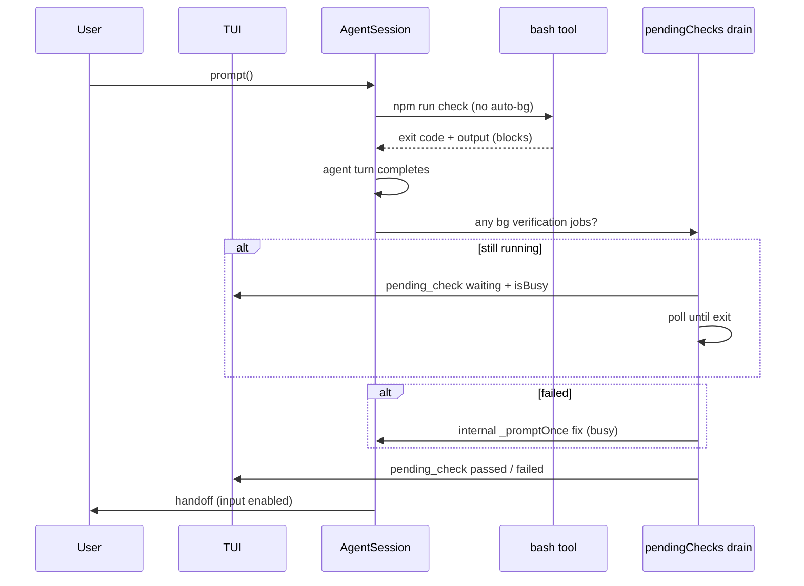

# Pending Checks Handoff — Design

Date: 2026-06-28  
Status: Approved

## Problem

When the Pit agent runs a long check (`npm run check`, vitest, etc.) and the turn ends,
the user sometimes receives a final report while the check is still running. When the
check later fails, the session re-injects a fix prompt, the agent corrects and re-runs,
and the original report is buried under new test output — a noisy, confusing cycle.

Root causes in the current codebase:

1. **Auto-background at 60s** — the agent `bash` tool opts into `autoBackground: true`;
   checks that exceed the threshold return `promoted to background id=bg-N (still running)`
   before exit code is known.
2. **Early handoff** — TUI `isIdle` uses only `isStreaming`, not background jobs or the
   verification drain phase; input unlocks while checks run.
3. **Post-hoc guard** — `_guardPendingBackgroundChecks` runs after the assistant message
   is already visible; on failure it injects a new user-visible turn instead of holding the
   session busy.
4. **Settings coupling** — the guard is gated on `verification.enabled`. PiTest sets
   `verification.enabled: false`, so the guard is a no-op even though checks still run.

## Reference behavior (Claude Code / Grok)

| System | Check execution | Handoff while check runs |
|--------|-----------------|--------------------------|
| **Claude Code** | Bash blocks by default; background is explicit (Ctrl+b) | `/goal` and Stop hooks see `background_tasks`; evaluator waits |
| **Grok (Cursor)** | Model chooses `block_until_ms` vs background; no native engine gate | Possible if model backgrounds and responds early |
| **Pit (today)** | Auto-promotes at 60s | Guard exists but off when `verification.enabled: false`; UI ignores bg jobs |

Target: Pit should behave like **Claude Code blocking default** + **busy-until-settled**,
not like auto-background + post-hoc re-injection.

## Goals

- User never gets the input prompt while a verification-class check started this prompt
  cycle is still running.
- TUI shows a clear waiting state (`Aguardando npm run check…`) with elapsed time.
- The agent does not deliver a "done / ready to commit" handoff until the check has
  finished (pass) or the bounded internal fix loop has exhausted attempts (honest failure).
- `pendingChecks` is **independent** of `verification.enabled` (default ON).
- Watchers/dev servers (`npm run dev`) remain exempt — never block handoff indefinitely.

## Non-goals

- Changing the verification gate's fix loop for file-touching turns (stays as-is).
- Blocking on arbitrary long-running non-check commands (builds, installs, servers).
- Collapsing/hiding premature "done" messages in the transcript (phase 2).
- RPC / headless mode UI polish beyond emitting events.

## Architecture

Three layers, applied in order:

### Layer 1 — Prevent promotion (primary)

In `packages/coding-agent/src/core/tools/bash.ts`, when the agent tool executes a command
classified by `isVerificationJobCommand()` (`pending-checks.ts`), pass
`autoBackground: false` to `ops.exec`. The bash tool blocks until the process exits (loader
shows elapsed time in the activity row). The model cannot write a final report in the same
turn before seeing the exit code.

Explicit `background: true` on a verification command: still allowed, but Layer 2 drains
before handoff.

### Layer 2 — Drain before handoff (safety net)

Replace/enhance `_guardPendingBackgroundChecks` in `agent-session.ts`:

- Rename conceptually to **pending-checks drain**; gate on `pendingChecks.enabled` (not
  `verification.enabled`).
- At end of `prompt()`, before returning control: if any `pendingVerificationJobs()` are
  still running, enter `_inPendingChecksDrain = true` (folded into `isBusy`).
- Poll until all tracked jobs exit or `pendingChecks.maxWaitMs` elapses.
- Emit `pending_check` session events for TUI status (waiting / passed / failed / timeout).
- **Do not return `prompt()`** until drain completes (pass) or internal remediation finishes.

### Layer 3 — Internal remediation (anti-noise)

When drain finds failed jobs, or jobs still running after `maxWaitMs`:

- Run up to `pendingChecks.maxFixAttempts` internal `_promptOnce()` continuations **while
  `isBusy` remains true** — user input stays blocked.
- Use existing `pendingChecksPrompt()` / `verificationFixPrompt()` text; do not add new
  user-visible prompt lines to the transcript beyond what the agent loop already produces.
- After attempts exhausted: emit `pending_check` failed, allow handoff with honest summary
  instruction (reuse `verificationExhaustedPrompt` pattern).
- **No** open-ended re-injection loop after handoff.

## Settings

New top-level key in `settings.json` (merged like other settings):

```json
{
  "pendingChecks": {
    "enabled": true,
    "maxWaitMs": 900000,
    "maxFixAttempts": 2
  }
}
```

| Field | Default | Meaning |
|-------|---------|---------|
| `enabled` | `true` | Drain + no-promotion policy active |
| `maxWaitMs` | `900000` (15 min) | Max wait for background checks to settle before remediation |
| `maxFixAttempts` | `2` | Internal fix continuations while busy |

`verification.enabled` remains independent (native gate after file edits).

Opt-out: `PIT_NO_PENDING_CHECKS=1` mirrors other Pit env killswitches.

## Data flow



## Components

### `pending-checks.ts` (existing)

- Keep `isVerificationJobCommand` / `pendingVerificationJobs`.
- Export unchanged; used by bash, drain, `goal_complete`.

### `settings-manager.ts`

- Add `PendingChecksSettings` interface + `getPendingChecksSettings()`.

### `bash.ts`

- In agent tool `execute`: `autoBackground: !isVerificationJobCommand(command)`.
- Optional: append hint in tool guidelines — "Do not pass `background: true` for test/check
  commands unless starting a watcher."

### `agent-session.ts`

- Add `_inPendingChecksDrain` flag; `isBusy` includes it.
- Refactor `_guardPendingBackgroundChecks` → `_awaitPendingChecksBeforeHandoff`:
  - Uses `getPendingChecksSettings()`.
  - Bounded poll loop (500ms tick, existing pattern).
  - Internal fix loop with `maxFixAttempts`.
  - Re-check registry after each fix continuation.
- `interrupt()` aborts drain (existing `_verificationAbort` pattern or dedicated abort).

### `agent-session-events.ts`

- Add event:

```ts
| {
    type: "pending_check";
    phase: "waiting" | "passed" | "failed" | "timeout";
    command: string;
    elapsedMs?: number;
    exitCode?: number;
    attempt?: number;
    maxAttempts?: number;
  }
```

### `interactive-mode.ts`

- `isIdle: () => !this.session.isBusy` (was `!isStreaming`).
- `isSessionBusy: () => this.session.isBusy || this.session.isCompacting`.
- Handler for `pending_check`: status line + terminal progress (reuse verification UX).
- Keep loader alive while `isBusy` (verify `workingVisible` path covers drain).

### `goal-complete.ts`

- Gate on `getPendingChecksSettings().enabled` + `pendingVerificationJobs` (unchanged
  logic; already refuses while checks run).

## Error handling

| Case | Behavior |
|------|----------|
| User Esc during drain | `interrupt()` sets `_userInterrupted`; drain exits; handoff |
| Job exits spawn error (`exitCode: null`) | Treat as failure (existing guard logic) |
| `maxWaitMs` exceeded, still running | `timeout` phase → internal fix attempt with "STILL running" prompt |
| `maxFixAttempts` exhausted | Handoff with exhausted prompt; user sees honest failure |
| `pendingChecks.enabled: false` | No drain; auto-bg disabled still applies if we only gate drain on enabled — **Layer 1 (no promotion) applies whenever `pendingChecks.enabled` OR always for verification commands** |

**Locked decision:** Layer 1 (no auto-bg for verification commands) is tied to
`pendingChecks.enabled` default true. When disabled entirely, revert to current auto-bg
behavior for backwards compatibility.

## Testing

| Test file | Covers |
|-----------|--------|
| `pending-checks.test.ts` | Unchanged classification tests |
| `pending-checks-gate.test.ts` | Update: drain with `pendingChecks.enabled`, not `verification` |
| `bash-no-autobg-check.test.ts` (new) | Verification command never gets `promotedJobId` under slow exec |
| `pending-checks-busy.test.ts` (new) | `isBusy` true during drain; `prompt()` doesn't resolve until job exits |
| `tool-feedback-settings.test.ts` or new | Default `pendingChecks` settings |

Gate: `npm run check` on touched files.

## PiTest project note

`.pit/settings.json` has `verification.enabled: false`. After this change, pending checks
still protect handoff. User may optionally re-enable `verification` for the native
post-edit gate — orthogonal.

## Success criteria

1. Agent runs `npm run check` (>60s): user sees loader, input blocked, no "done" report
   until check completes.
2. Backgrounded check (synthetic test): `prompt()` blocks until exit; TUI shows waiting status.
3. Failed check: at most `maxFixAttempts` internal continuations while busy; then handoff.
4. `npm run dev` background: handoff not blocked.
5. `pendingChecks.enabled: false`: legacy auto-bg behavior restored.